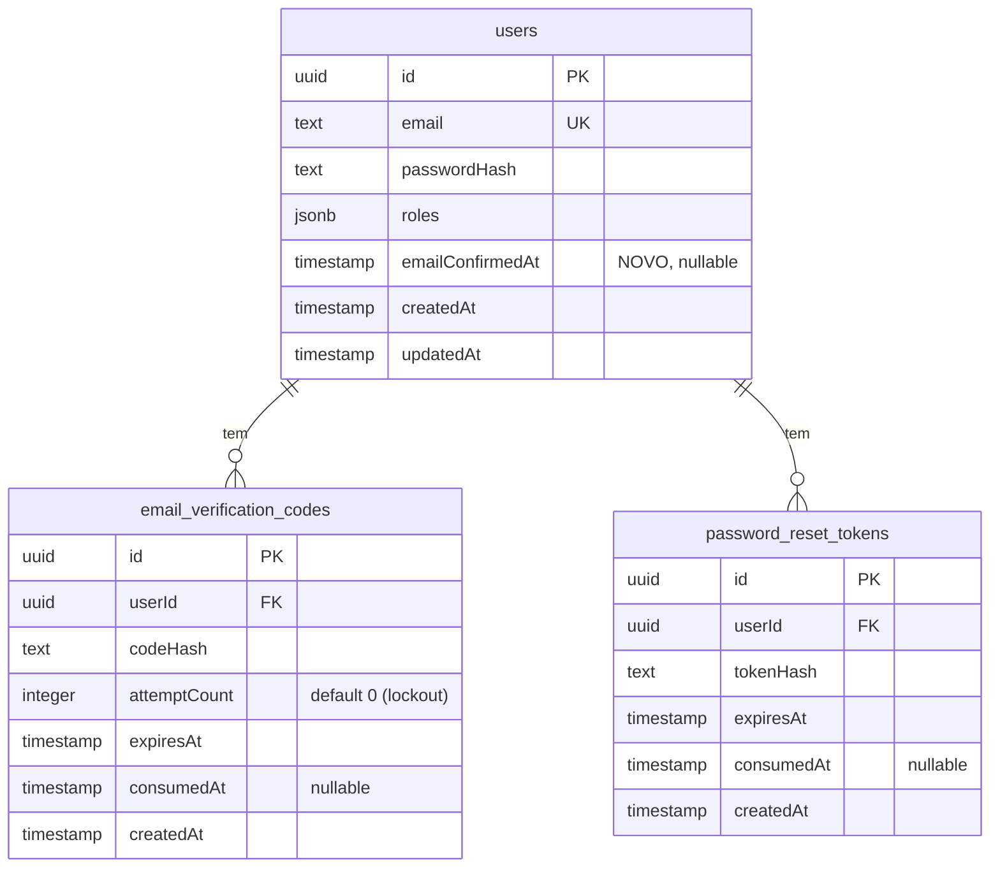

# feat: Verificação de conta por email e reset de senha (full-stack)

## Summary

Tornar o fluxo de autenticação do Kinguila real, ligando os ecrãs de front-end já
existentes (login, criar conta) ao back-end e introduzindo dois fluxos novos:

1. **Verificação de conta por código de email.** Ao registar, a conta nasce **não
   confirmada** e não recebe JWT. A plataforma envia (via Resend) um email com um código
   de 6 dígitos. O utilizador insere o código num ecrã de validação; a conta é confirmada
   e só então são emitidos os tokens JWT. O login passa a recusar contas não confirmadas.
2. **Reset de senha por link.** O utilizador pede reset com o email; recebe um email com um
   link contendo um **token opaco**. O ecrã valida o token e permite definir uma senha
   nova; o token é de uso único e expira.

Inclui a integração nova com a **Resend** (seguindo o padrão `HttpIntegrationClient` /
`ExchangeRateClient`), as migrations manuais para o novo estado e tabelas, os ecrãs Vue em
falta, e um ADR a registar as decisões de identity.

**Decisões já tomadas com o utilizador:** (1) duas tabelas dedicadas, uma para códigos de
confirmação e outra para tokens de reset; (2) reset por **token opaco longo** no link; (3)
códigos e tokens guardados em **hash SHA-256**, nunca em plaintext.

---

## Problem Frame

O front-end tem os ecrãs de login e registo, mas não há fluxo real: o back-end tem um
scaffold de auth (`register`/`login`/`me`) que emite JWT imediatamente no registo e não
distingue contas confirmadas de não confirmadas. Não há forma de a plataforma confirmar que
o email pertence à pessoa, nem de recuperar acesso a uma conta. Falta também o canal de
envio de email (Resend) e os dois ecrãs de front-end (validação de conta, reset de senha).

O objetivo é fechar este ciclo de ponta a ponta, respeitando a Clean Architecture do
back-end e a arquitetura por feature do front-end, sem inventar estruturas novas — copiando
os padrões vivos (`ExchangeRateClient` para a integração, a feature `offers`/`auth` para o
front-end) e espelhando o fluxo já provado em `maya-payment-application` (com endurecimento
de segurança: hashing dos códigos, que a referência não faz).

---

## Requirements

| ID  | Requisito | Origem |
| --- | --------- | ------ |
| R1  | Ao registar, a conta é criada **não confirmada** e o registo **não** devolve tokens JWT. | pedido do utilizador |
| R2  | Ao registar, é gerado um código de 6 dígitos e enviado por email (Resend). | pedido |
| R3  | Existe um ecrã/endpoint para inserir o código; ao validar com sucesso, a conta fica confirmada e são emitidos os tokens JWT. | pedido |
| R4  | O login recusa contas não confirmadas com erro distinto (403), diferente de credenciais inválidas (401). | pedido |
| R5  | Contas já confirmadas fazem login normalmente (sem nova confirmação). | pedido |
| R6  | É possível reenviar o código de confirmação, com rate-limit. | inferido (maya) |
| R7  | Existe endpoint para pedir reset de senha a partir do email; resposta genérica que não revela se o email existe. | pedido + segurança |
| R8  | O pedido de reset envia um email com um link contendo um token opaco. | pedido |
| R9  | Existe validação do token de reset (saber se o link ainda é válido) antes de permitir nova senha. | pedido |
| R10 | É possível definir uma senha nova via token válido; o token é de uso único e expira. | pedido |
| R11 | Códigos e tokens são persistidos apenas em hash (SHA-256), com expiração e estado de consumo. | decisão do utilizador |
| R12 | Toda rota nova é documentada em OpenAPI e aparece na Swagger UI (`/docs`). | regra de ouro nº9 |
| R13 | Migrations são geradas e revistas, mas aplicadas **manualmente** pelo utilizador. | regra de ouro nº4 |
| R14 | Existem ecrãs de front-end de validação de conta e de reset de senha, seguindo a feature `auth`. | pedido |
| R15 | Toda implementação tem teste em `apps/api/tests/` (camada dedicada). | regra de ouro nº7 |
| R16 | O código de confirmação tem limite de tentativas (lockout) antes de invalidar. | revisão de segurança |
| R17 | Erros relevantes carregam um `code` legível por máquina (FE não ramifica por texto). | revisão (coherence/design) |
| R18 | A migration faz backfill de `email_confirmed_at` para contas pré-existentes. | revisão (adversarial) |
| R19 | Existe endpoint de refresh que troca um refresh token válido por um novo par de tokens. | pedido do utilizador |
| R20 | Tokens cujo `tokenVersion` não corresponde ao do utilizador são recusados (revogação). | pedido do utilizador |
| R21 | O logout invalida os tokens do utilizador (incrementa `tokenVersion`), não só limpa o cliente. | pedido do utilizador |
| R22 | O front-end usa o refresh token para renovar a sessão automaticamente quando o access expira. | pedido do utilizador |

---

## Key Technical Decisions

- **KTD1 — Estado de confirmação como timestamp nullable.** Adicionar `emailConfirmedAt:
  Date | null` à entidade `User` (em vez de booleano): preserva *quando* foi confirmado e
  "confirmado" = não-null. Coluna Postgres `timestamp` nullable.
- **KTD2 — Duas tabelas dedicadas** (decisão do utilizador). `email_verification_codes`
  (confirmação de conta) e `password_reset_tokens` (reset), cada uma com entidade de
  domínio, schema Drizzle e repositório próprios. Alinha com a regra de responsabilidade
  única; cada uma tem ciclo de vida e validações próprias.
- **KTD3 — Hash dos segredos** (decisão do utilizador). Guardar apenas o hash SHA-256 do
  código/token (`codeHash` / `tokenHash`), comparando hashes na validação — mesmo princípio
  do `passwordHash`. Difere da referência maya (plaintext), por segurança.
- **KTD4 — Código de 6 dígitos para conta; token opaco longo para reset.** O código curto
  cabe num ecrã de input (como pedido); o reset usa um token de 32 bytes aleatórios
  (base64url) embutido num link — é literalmente um "link" e resiste a brute-force online.
- **KTD5 — Não reutilizar `JwtTokenService` para confirmação/reset.** O `verify` atual
  rejeita qualquer `type` que não seja `access`. Confirmação usa código curto (não JWT) e
  reset usa token opaco persistido — ambos validados contra a BD, não por assinatura JWT.
- **KTD6 — `IVerificationTokenFactory` na camada de identity.** Interface na `application`
  (`generateCode()`, `generateToken()`, `hash(value)`, `verify(value, hash)`),
  implementação na `infrastructure/identity`. Isola a aleatoriedade/hash e torna os
  serviços testáveis com fakes.
- **KTD7 — Resend segue o padrão de integração existente.** Contrato `IEmailProvider` na
  `application`; `ResendClient` estende `HttpIntegrationClient` (`POST https://api.resend.com/emails`,
  header `Authorization: Bearer <RESEND_API_KEY>`); modelos crus isolados em `models/`. O
  **conteúdo** dos emails (assunto/HTML/link) é construído na `application`, não nos modelos
  crus — `IEmailProvider.send` recebe uma `EmailMessage` limpa.
- **KTD8 — Serviços separados por responsabilidade.** `EmailVerificationService`
  (confirm/resend) e `PasswordResetService` (request/validate/reset), distintos do
  `AuthService`. O `AuthService.register` cria o utilizador e delega o envio do código; o
  `AuthService.login` passa a verificar `emailConfirmedAt`.
- **KTD9 — Mensagens genéricas anti-enumeração.** `requestPasswordReset` e `resendCode`
  devolvem sempre sucesso genérico, sem revelar se o email existe — coerente com a mensagem
  genérica de credenciais já usada no `login`.
- **KTD10 — Status HTTP.** 401 credenciais inválidas; **403 conta não confirmada / token
  expirado/inválido**; 409 email já registado; 422 validação Zod.
- **KTD11 — Código de erro legível por máquina.** O envelope de erro passa a incluir um
  `code` estável (ex. `ACCOUNT_NOT_CONFIRMED`, `INVALID_OR_EXPIRED_TOKEN`,
  `CODE_LOCKED_OUT`) além da mensagem. O front-end ramifica por `code`, nunca por
  comparação da string de mensagem em português (frágil a mudanças de copy). Documentado em
  OpenAPI e refletido em `packages/contracts` (`ApiResponse`/`errorResponseSchema`).
- **KTD12 — Limite de tentativas (lockout) em âmbito.** Após análise de segurança, o lockout
  do código de confirmação entra **nesta fatia** (não diferido): um código de 6 dígitos
  (10^6) com TTL de 15 min e só rate-limit de reenvio fica vulnerável a brute-force online
  contra o endpoint `confirm`. A tabela `email_verification_codes` ganha `attemptCount`; o
  `confirm` invalida o código após N tentativas falhadas (ex. 5). É a defesa principal —
  não deve ser diferida. Ver Risks.
- **KTD13 — Sessão: `tokenVersion` + refresh token.** Invalidação de sessão por um inteiro
  `users.token_version`, incluído nos claims do access e do refresh token. O `authMiddleware`
  compara o `tokenVersion` do token com o da BD (1 leitura por pedido autenticado); o
  endpoint `refresh` revalida o refresh token + `tokenVersion` e emite novo par; o **logout
  incrementa `token_version`**, invalidando instantaneamente **todos** os tokens (access +
  refresh) do utilizador — logout global, sem tabela nova nem Redis. Refresh mantém-se
  stateless (JWT). Trade-off: logout afeta todos os dispositivos e há uma leitura à BD por
  pedido autenticado.

---

## High-Level Technical Design

### Fluxo de verificação de conta

```mermaid
sequenceDiagram
    actor U as Utilizador
    participant FE as Front-end (Vue)
    participant API as AuthController / EmailVerificationController
    participant AS as AuthService
    participant EVS as EmailVerificationService
    participant DB as Postgres
    participant R as Resend

    U->>FE: Submete registo (RegisterView)
    FE->>API: POST /auth/register
    API->>AS: register(dto)
    AS->>DB: cria User (emailConfirmedAt = null)
    AS->>EVS: sendCode(userId, email)
    EVS->>DB: invalida códigos anteriores; grava codeHash + expiresAt
    EVS->>R: send(EmailMessage com código 6 dígitos)
    API-->>FE: 201 (sem tokens) → redireciona p/ VerifyEmailView
    U->>FE: Insere código
    FE->>API: POST /auth/confirm-email { email, code }
    API->>EVS: confirm(email, code)
    EVS->>DB: valida hash/expiração/consumo/tentativas; marca consumido + emailConfirmedAt
    EVS->>EVS: emite tokens via ITokenService (injetado, não via AuthService)
    API-->>FE: 200 AuthResponse (tokens) → autenticado
```

### Fluxo de reset de senha

```mermaid
sequenceDiagram
    actor U as Utilizador
    participant FE as Front-end (Vue)
    participant API as Controller
    participant PRS as PasswordResetService
    participant DB as Postgres
    participant R as Resend

    U->>FE: Pede reset (email)
    FE->>API: POST /auth/request-password-reset { email }
    API->>PRS: request(email)
    PRS->>DB: se user existe, grava tokenHash + expiresAt
    PRS->>R: send(link WEB_APP_URL/reset-password?token=...)
    API-->>FE: 200 genérico (não revela existência)
    U->>FE: Abre link → ResetPasswordView extrai token
    FE->>API: POST /auth/validate-reset-token { token }
    API->>PRS: validateToken(token) → válido/expirado
    API-->>FE: 200 / 403 (mostra ou não o formulário)
    U->>FE: Define nova senha
    FE->>API: POST /auth/reset-password { token, password }
    API->>PRS: reset(token, password)
    PRS->>DB: valida; re-hash password; consome token; invalida restantes
    API-->>FE: 200 → redireciona p/ login
```

### Modelo de dados novo



---

## Output Structure

Ficheiros **novos** previstos (os existentes são modificados in-place):

```
apps/api/src/
├── domain/entities/
│   ├── EmailVerificationCode.ts            (novo)
│   └── PasswordResetToken.ts               (novo)
├── application/
│   ├── interfaces/
│   │   ├── identity/IVerificationTokenFactory.ts        (novo)
│   │   ├── integrations/IEmailProvider.ts               (novo)
│   │   ├── repositories/IEmailVerificationCodeRepository.ts  (novo)
│   │   ├── repositories/IPasswordResetTokenRepository.ts     (novo)
│   │   └── services/{IEmailVerificationService,IPasswordResetService}.ts (novos)
│   ├── services/
│   │   ├── EmailVerificationService.ts     (novo)
│   │   └── PasswordResetService.ts         (novo)
│   └── email/templates/authEmails.ts       (novo — assunto/HTML dos emails)
├── infrastructure/
│   ├── identity/VerificationTokenFactory.ts             (novo)
│   ├── integrations/email/ResendClient.ts               (novo)
│   ├── integrations/email/models/resendApi.ts           (novo)
│   ├── repositories/{EmailVerificationCodeRepository,PasswordResetTokenRepository}.ts (novos)
│   └── database/schema/{emailVerificationCodes,passwordResetTokens}.ts (novos)
└── presentation/http/
    ├── (validators/controllers/routes/openapi — modificados)

apps/web/src/features/auth/
├── views/VerifyEmailView.vue               (novo)
├── views/ResetPasswordView.vue             (novo)
└── components/VerificationCodeInput.vue    (novo)

packages/contracts/src/auth.ts              (modificado)
docs/adr/0002-autenticacao-verificacao-reset.md  (novo)
```

---

## Implementation Units

> Agrupadas em 4 fases. Migrations são geradas e **entregues ao utilizador** para aplicação
> manual (R13) — ver skill `run-migrations`.

### Fase 1 — Contratos e fundações de back-end

### U1. Tipos partilhados (contracts)

- **Goal:** Definir os Request/Response novos partilhados entre FE e BE.
- **Requirements:** R1, R3, R7, R10.
- **Dependencies:** nenhuma.
- **Files:** `packages/contracts/src/auth.ts` (modificar), `packages/contracts/src/index.ts`
  (confirmar reexport).
- **Approach:** Acrescentar `ConfirmEmailRequest` (`email`, `code`), `ResendCodeRequest`
  (`email`), `RequestPasswordResetRequest` (`email`), `ValidateResetTokenRequest` (`token`),
  `ResetPasswordRequest` (`token`, `password`). A resposta de `confirmEmail` reaproveita
  `AuthResponse`. Ajustar o tipo de resposta de `register` para refletir "sem tokens"
  (estado pendente) — ex. `RegisterResponse` com `{ email, verificationRequired: true }`.
  Acrescentar um campo opcional `code` ao envelope de erro (`ApiResponse`/erro) para os
  códigos legíveis por máquina (KTD11), consumido pelo front-end.
- **Patterns to follow:** estrutura atual de `packages/contracts/src/auth.ts` (só tipos).
- **Test scenarios:** `Test expectation: none -- pacote só de tipos, sem comportamento. A
  validação de compilação cobre via typecheck dos consumidores.`
- **Verification:** `bun run typecheck` passa em `apps/api` e `apps/web` após referenciarem
  os novos tipos.

### U2. Estado de confirmação + tabelas novas (domain + schema + migration)

- **Goal:** Modelar `emailConfirmedAt` em `User` e criar as duas tabelas novas.
- **Requirements:** R1, R11, R13.
- **Dependencies:** nenhuma.
- **Files:**
  - `apps/api/src/domain/entities/User.ts` (add `emailConfirmedAt: Date | null`)
  - `apps/api/src/domain/entities/EmailVerificationCode.ts` (novo)
  - `apps/api/src/domain/entities/PasswordResetToken.ts` (novo)
  - `apps/api/src/infrastructure/database/schema/users.ts` (add coluna `email_confirmed_at` nullable)
  - `apps/api/src/infrastructure/database/schema/emailVerificationCodes.ts` (novo)
  - `apps/api/src/infrastructure/database/schema/passwordResetTokens.ts` (novo)
  - `apps/api/src/infrastructure/database/schema/index.ts` (reexportar os novos)
  - migration gerada em `apps/api/src/infrastructure/database/migrations/` (revista, não aplicada)
- **Approach:** Entidades de domínio puras (sem libs). Schemas Drizzle com `id` uuid PK,
  `userId` FK → `users.id` (com `references` + `onDelete: 'cascade'`), `codeHash`/`tokenHash`
  text, `expiresAt`/`createdAt` timestamp, `consumedAt` timestamp nullable. A tabela
  `email_verification_codes` inclui `attemptCount integer not null default 0` (suporta o
  lockout — KTD12). Exportar `Row`/`InsertRow`. Após alterar o schema: `bun run db:generate`,
  **rever o SQL**, e entregar ao utilizador o comando `db:migrate` — nunca aplicar.
  - **Backfill obrigatório:** a coluna `email_confirmed_at` é nullable, mas os utilizadores
    já existentes (incluindo os de seed) ficariam com `null` e seriam **bloqueados no login**
    (403) pela nova regra. A migration tem de fazer backfill — `UPDATE users SET
    email_confirmed_at = now() WHERE email_confirmed_at IS NULL` — para preservar o acesso de
    contas pré-existentes. Rever este statement com atenção antes de aplicar.
- **Patterns to follow:** `apps/api/src/infrastructure/database/schema/users.ts` e o
  `schema/index.ts`; skill `add-entity` e `run-migrations`.
- **Test scenarios:**
  - As entidades de domínio expõem os campos esperados (teste de construção trivial, se
    houver lógica de "isExpired"/"isConsumed" como getters de domínio — incluir testes desses
    predicados: expirado vs válido; consumido vs por consumir; tentativas esgotadas vs não).
  - `Covers R11.` Um registo persistido guarda `codeHash`/`tokenHash` (nunca o valor cru).
  - Backfill: após a migration, contas pré-existentes têm `emailConfirmedAt` não-null (não
    ficam bloqueadas no login). Verificar com um registo de seed.
- **Verification:** schema compila; SQL gerado contém as duas tabelas + coluna nova +
  FKs/índices; migration revista entregue ao utilizador.

### U3. Fábrica de códigos/tokens (identity)

- **Goal:** Gerar código de 6 dígitos, token opaco, e hash/verify SHA-256.
- **Requirements:** R2, R8, R11.
- **Dependencies:** nenhuma.
- **Files:**
  - `apps/api/src/application/interfaces/identity/IVerificationTokenFactory.ts` (novo)
  - `apps/api/src/infrastructure/identity/VerificationTokenFactory.ts` (novo)
- **Approach:** Interface com `generateCode(): string` (6 dígitos, fonte CSPRNG —
  `crypto.getRandomValues`, **não** `Math.random`), `generateToken(): string` (32 bytes
  base64url), `hash(value): string` (SHA-256 hex), `verify(value, hash): boolean`
  (comparação em tempo constante). Implementação na infra.
- **Patterns to follow:** `apps/api/src/infrastructure/identity/PasswordHasher.ts` e
  `JwtTokenService.ts` (interface na application, impl na infra).
- **Test scenarios:**
  - `generateCode` devolve sempre 6 dígitos numéricos; amostragem mostra variação (não
    constante).
  - `generateToken` devolve string base64url de comprimento esperado e única entre chamadas.
  - `hash` é determinístico para o mesmo input e difere para inputs diferentes.
  - `verify(value, hash(value))` é `true`; `verify(other, hash(value))` é `false`.
  - Edge: `verify` com hash malformado devolve `false` sem lançar.
- **Verification:** testes unitários passam; nenhum uso de `Math.random`.

### U4. Integração Resend (envio de email)

- **Goal:** Canal de envio de email seguindo o padrão de integração existente.
- **Requirements:** R2, R8, R12 (settings/env).
- **Dependencies:** nenhuma.
- **Files:**
  - `apps/api/src/application/interfaces/integrations/IEmailProvider.ts` (novo — `send(message: EmailMessage)`, tipo `EmailMessage = { to; subject; html }`)
  - `apps/api/src/infrastructure/integrations/email/ResendClient.ts` (novo)
  - `apps/api/src/infrastructure/integrations/email/models/resendApi.ts` (novo — request/response crus da Resend)
  - `apps/api/src/application/email/templates/authEmails.ts` (novo — `buildVerificationCodeEmail(code)`, `buildPasswordResetEmail(link)` → `{ subject, html }`)
  - `apps/api/src/config/env.ts` (add `RESEND_API_KEY`, `EMAIL_FROM`, `WEB_APP_URL`,
    `EMAIL_CODE_TTL` default `15m`, `PASSWORD_RESET_TOKEN_TTL` default `1h`,
    `EMAIL_RESEND_RATE_LIMIT_SECONDS` default `60`, `EMAIL_CODE_MAX_ATTEMPTS` default `5`)
  - `.env.example` (documentar as novas vars)
- **Approach:** `ResendClient` estende `HttpIntegrationClient` (baseUrl `https://api.resend.com`,
  `defaultHeaders` com `Authorization: Bearer <RESEND_API_KEY>`), faz `POST /emails` com
  `{ from: EMAIL_FROM, to, subject, html }`, mapeia a resposta crua. Templates HTML inline
  (assunto + corpo) vivem na `application` (`authEmails.ts`), recebendo apenas dados de
  domínio (código, link).
  - **Validação condicional por ambiente (importante):** o padrão atual do `env.ts`
    (`EXCHANGE_RATE_API_KEY: z.string().default('')`) **não** falha em produção — arranca
    silenciosamente. Para cumprir o "falhar cedo em produção", usar `z.superRefine` (ou
    `.refine`) no `envSchema` que exija `RESEND_API_KEY`, `EMAIL_FROM` e `WEB_APP_URL`
    não-vazios quando `NODE_ENV === 'production'`; em dev mantêm default `''`/local.
    `WEB_APP_URL` validado como `z.string().url()` (não só `string`) para o link de reset
    não partir em runtime.
- **Patterns to follow:** `apps/api/src/infrastructure/integrations/exchangeRate/ExchangeRateClient.ts`,
  `.../models/exchangeRateApi.ts`, `apps/api/src/application/interfaces/integrations/IExchangeRateProvider.ts`;
  `docs/integrations.md`; skill `add-integration`.
- **Test scenarios:**
  - `Covers R2/R8.` `ResendClient.send` faz `POST` ao endpoint certo com header de
    autorização e corpo `{from,to,subject,html}` correto (teste com `fetch` mockado).
  - Resposta de erro da Resend (status não-2xx) → lança/propaga `IntegrationError`.
  - Timeout do `fetch` → `IntegrationError` (não promessa pendente).
  - `buildVerificationCodeEmail` inclui o código no HTML e um assunto não vazio.
  - `buildPasswordResetEmail` inclui o link exato (com token) e não expõe nada além do link.
- **Patterns/refs de teste:** `apps/api/tests/unit/infrastructure/integrations/ExchangeRateClient.test.ts`.
- **Verification:** testes com `fetch` mockado passam; env valida no arranque.

### Fase 2 — Serviços de aplicação e persistência

### U5. Repositórios das novas tabelas

- **Goal:** Persistência tipada para códigos e tokens.
- **Requirements:** R3, R6, R9, R10, R11.
- **Dependencies:** U2.
- **Files:**
  - `apps/api/src/application/interfaces/repositories/IEmailVerificationCodeRepository.ts` (novo)
  - `apps/api/src/application/interfaces/repositories/IPasswordResetTokenRepository.ts` (novo)
  - `apps/api/src/infrastructure/repositories/EmailVerificationCodeRepository.ts` (novo)
  - `apps/api/src/infrastructure/repositories/PasswordResetTokenRepository.ts` (novo)
  - `apps/api/src/infrastructure/repositories/UserRepository.ts` (modificar `mapRow`/`toRow` para `emailConfirmedAt`)
- **Approach:** Interfaces específicas herdam de `IGenericRepository<T>` e acrescentam:
  - `IEmailVerificationCodeRepository`: `findActiveByUserId(userId)`,
    `findLatestByUserId(userId)` (rate-limit), `invalidateAllByUserId(userId)`,
    `markConsumed(id)`, `incrementAttempt(id)` (lockout — KTD12). A validação do **código**
    é por `userId` (resolvido via email no serviço) + comparação de hash do código ativo.
  - `IPasswordResetTokenRepository`: `findActiveByTokenHash(tokenHash)` **(necessário)** —
    `validateToken`/`reset` recebem só o token, sem `userId`, logo o lookup tem de ser pelo
    hash do token; mais `findLatestByUserId`, `invalidateAllByUserId`, `markConsumed(id)`.
  - **`update`/`markConsumed` não podem usar o `update` genérico herdado:** o
    `DrizzleGenericRepository.update()` faz `.set({ ...toRow, updatedAt: new Date() })`, mas
    as tabelas novas **não têm** `updatedAt` → o SQL referenciaria uma coluna inexistente e
    falharia. `markConsumed`/`invalidateAllByUserId`/`incrementAttempt` usam um
    `db.update(...).set(...)` custom (sem `updatedAt`).
- **Patterns to follow:** `apps/api/src/infrastructure/repositories/UserRepository.ts`,
  `DrizzleGenericRepository.ts`, `IUserRepository.ts`.
- **Test scenarios:**
  - `markConsumed` define `consumedAt` e o registo deixa de ser "ativo".
  - `invalidateAllByUserId` marca todos os não consumidos do utilizador como consumidos.
  - `findLatestByUserId` devolve o mais recente por `createdAt` (suporta rate-limit).
  - `findActiveByTokenHash` localiza o registo ativo pelo hash do token; devolve `null` para
    hash inexistente/consumido/expirado.
  - `incrementAttempt` incrementa `attemptCount`; após o limite o código deixa de validar.
  - Edge: utilizador/hash sem registos → `findLatest`/`findActive`/`findActiveByTokenHash`
    devolvem `null`.
- **Patterns/refs de teste:** testes de repositório existentes em `apps/api/tests/` (mesma
  estratégia que `UserRepository`).
- **Verification:** testes de repositório passam.

### U6. EmailVerificationService + alterações ao AuthService

- **Goal:** Confirmar conta, reenviar código, e ajustar register/login.
- **Requirements:** R1, R3, R4, R5, R6, R9 (genérico), R11.
- **Dependencies:** U3, U4, U5.
- **Files:**
  - `apps/api/src/application/interfaces/services/IEmailVerificationService.ts` (novo)
  - `apps/api/src/application/services/EmailVerificationService.ts` (novo)
  - `apps/api/src/application/services/AuthService.ts` (modificar `register`, `login`)
  - `apps/api/src/application/interfaces/services/IAuthService.ts` (ajustar assinatura de `register`)
- **Approach:**
  - **Emissão de tokens:** o `EmailVerificationService` recebe `ITokenService` **injetado**
    e constrói o `AuthResponse` ele próprio (claims sub/email/roles do user). **Não** delega
    ao `AuthService` (evita acoplamento/dependência circular; `buildAuthResponse` é privado).
    Alinha com KTD8 e o diagrama corrigido.
  - `EmailVerificationService.sendCode(userId, email)`: invalida códigos anteriores, gera
    código (U3), grava `codeHash` + `expiresAt` (now + `EMAIL_CODE_TTL`), envia email (U4).
  - `confirm(email, code)`: resolve user por email; obtém código ativo; **se
    `attemptCount >= EMAIL_CODE_MAX_ATTEMPTS` → 403 `CODE_LOCKED_OUT`**; compara hash; se não
    bate → `incrementAttempt` e 403; valida não-expirado/não-consumido; marca consumido +
    `user.emailConfirmedAt = now` **na mesma transação** (uso único atómico); emite tokens
    via `ITokenService`; devolve `Response.ok(AuthResponse)`. Falhas → `Response.fail(...,
    403)` com `code` apropriado (KTD11).
  - `resend(email)`: **resolve user por email; se não existe → sucesso genérico sem chamar o
    provider** (KTD9, evita timing-oracle); senão rate-limit via `findLatestByUserId`
    (rejeitar se < `EMAIL_RESEND_RATE_LIMIT_SECONDS`); fora da janela → `sendCode`. Resposta
    sempre genérica.
  - `AuthService.register`: cria user com `emailConfirmedAt = null`; chama `sendCode`. **Se
    o envio Resend falhar, NÃO propagar erro fatal** — o user fica criado e pendente; devolve
    201 com `verificationRequired: true` (o utilizador pode usar `resend`). Evita conta órfã
    bloqueada por 409 num re-registo. (Em alternativa, tratar re-`register` de email
    não-confirmado como reenvio — decisão registada no ADR.)
  - `AuthService.login`: após validar credenciais, se `emailConfirmedAt == null` →
    `Response.fail('Conta não confirmada.', [], 403)` **com `code: ACCOUNT_NOT_CONFIRMED`**
    (KTD11) para o FE distinguir do 401 de credenciais.
- **Patterns to follow:** `AuthService.ts` atual (uso de `Response`, injeção de
  `IPasswordHasher`/`ITokenService`). Mensagens genéricas como no `login` atual.
- **Execution note:** começar pelos testes de `confirm`/`login` (regras de negócio
  sensíveis) antes da implementação.
- **Test scenarios:**
  - `Covers R3.` `confirm` com código correto e válido → confirma conta e devolve tokens.
  - `Covers R4.` `login` de conta não confirmada → 403 com mensagem distinta de credenciais.
  - `Covers R5.` `login` de conta confirmada → 200 com tokens.
  - `confirm` com código errado → 403 e `attemptCount` incrementado; expirado → 403;
    já consumido → 403. Cada falha devolve o `code` correto (KTD11).
  - `Covers KTD12 (lockout).` Após `EMAIL_CODE_MAX_ATTEMPTS` tentativas erradas → 403
    `CODE_LOCKED_OUT`, mesmo que a tentativa seguinte traga o código correto.
  - `confirm` consome o código (segunda tentativa com o mesmo código falha).
  - `register` não devolve tokens e dispara `sendCode` exatamente uma vez (provider fake).
  - `register` quando o provider de email lança → user fica criado/pendente e a resposta é
    201 (não 5xx); não há conta órfã sem via de recuperação.
  - `Covers R6.` `resend` dentro da janela de rate-limit → recusa (sem reenviar); fora da
    janela → reenvia.
  - `Covers R9 (anti-enumeração).` `resend` para email inexistente → resposta de sucesso
    genérica, sem chamar o provider.
  - `login` de conta não confirmada devolve `code: ACCOUNT_NOT_CONFIRMED` (FE ramifica por
    código, não por mensagem).
  - Edge: `confirm` para email inexistente → 403 genérico (não revela inexistência).
- **Patterns/refs de teste:** fakes em `apps/api/tests/helpers/fakes/` (fake de
  `IUserRepository`, novos fakes de repositórios e de `IEmailProvider`/`IVerificationTokenFactory`).
- **Verification:** testes de serviço passam com fakes; sem dependência de BD real.

### U7. PasswordResetService

- **Goal:** Pedir reset, validar token, redefinir senha.
- **Requirements:** R7, R8, R9, R10, R11.
- **Dependencies:** U3, U4, U5.
- **Files:**
  - `apps/api/src/application/interfaces/services/IPasswordResetService.ts` (novo)
  - `apps/api/src/application/services/PasswordResetService.ts` (novo)
- **Approach:**
  - `request(email)`: se o user existe, invalida tokens anteriores, gera token opaco (U3),
    grava `tokenHash` + `expiresAt` (now + `PASSWORD_RESET_TOKEN_TTL`), envia email com link
    `WEB_APP_URL/reset-password?token=<token>` (U4). **Resposta sempre genérica** (KTD9).
  - `validateToken(token)`: `findActiveByTokenHash(hash(token))`; devolve `Response.ok` se
    válido, `Response.fail(..., 403, code: INVALID_OR_EXPIRED_TOKEN)` se
    expirado/consumido/inexistente. (Usado pelo ecrã antes de mostrar o formulário; é
    read-only e não consome o token.)
  - `reset(token, newPassword)`: revalida o token, re-hash da password (`IPasswordHasher`),
    atualiza user, marca token consumido e invalida restantes tokens do user — **a validação
    + marca-consumido têm de ser atómicas** (transação ou `UPDATE ... WHERE consumedAt IS
    NULL` condicional) para garantir uso único sob concorrência. Não confiar só no
    `validateToken` anterior (pode ter corrido noutra aba).
  - **Lookup por hash:** `findActiveByTokenHash` faz hash (SHA-256) do token recebido e
    procura o registo ativo com esse `tokenHash` (o token de 32 bytes tem entropia
    suficiente para o hash sem salt ser adequado).
- **Patterns to follow:** `AuthService.ts`; mesma injeção de dependências.
- **Execution note:** testes primeiro para `validateToken`/`reset` (caminhos de
  expiração/uso único).
- **Test scenarios:**
  - `Covers R7/R9 (anti-enumeração).` `request` para email inexistente → sucesso genérico,
    sem gravar token nem revelar inexistência; para email existente → grava token e envia.
  - `Covers R10.` `reset` com token válido → atualiza `passwordHash` e consome o token.
  - `validateToken`: token válido → ok; expirado → 403; consumido → 403; inexistente → 403.
  - `reset` com token já consumido/expirado → 403 e password **não** alterada.
  - `reset` consome o token (segunda tentativa falha) e invalida outros tokens do user.
  - Concorrência: dois `reset` quase-simultâneos com o mesmo token → só um sucede (o consumo
    é atómico); o segundo recebe 403.
  - Edge: `request` repetido invalida o token anterior (só o último é válido).
- **Patterns/refs de teste:** fakes de repositório + `IEmailProvider` + `IPasswordHasher`.
- **Verification:** testes de serviço passam com fakes.

### Fase 3 — Presentation e wiring

### U8. Rotas, validadores, controller, OpenAPI e composition root

- **Goal:** Expor os fluxos por HTTP, documentá-los e ligar a DI.
- **Requirements:** R1–R10, R12.
- **Dependencies:** U6, U7 (e U1 para os tipos).
- **Files:**
  - `apps/api/src/application/constants/apiRoutes.ts` (add `confirmEmail`, `resendCode`,
    `requestPasswordReset`, `validateResetToken`, `resetPassword` sob `auth`)
  - `apps/api/src/presentation/http/validators/auth.validators.ts` (novos schemas Zod)
  - `apps/api/src/presentation/http/controllers/AuthController.ts` (novos handlers finos)
  - `apps/api/src/presentation/http/routes/auth.routes.ts` (registar rotas **públicas**)
  - `apps/api/src/presentation/http/openapi/paths/auth.docs.ts` (documentar cada rota,
    incluindo respostas 403/422)
  - `apps/api/src/composition/container.ts` (registar `ResendClient`/`IEmailProvider`,
    `VerificationTokenFactory`, os dois repositórios, `EmailVerificationService`,
    `PasswordResetService`; injetar no controller)
- **Approach:** Handlers finos: `validated<T>(c)` → serviço → `toHttp`. Schemas Zod:
  `confirmEmailSchema` (`email`, `code` exatamente 6 dígitos), `resendCodeSchema` (`email`),
  `requestPasswordResetSchema` (`email`), `validateResetTokenSchema` (`token`),
  `resetPasswordSchema` (`token`, `password`). **Regra de força da password explícita** e
  reutilizada também no `registerSchema`: mínimo 8 caracteres + máximo 72 (limite do
  argon2id/bcrypt, evita DoS de hashing). Definir uma vez e partilhar. Rotas novas **sem**
  `requireAuth`. Documentar em OpenAPI reutilizando os schemas Zod e `errorResponseSchema`,
  **incluindo o campo `code`** nas respostas de erro (KTD11) e as respostas 403/422.
  Registar tudo no container (regra de ouro nº5 — senão falha em runtime).
- **Patterns to follow:** `AuthController.ts`, `auth.routes.ts`, `auth.validators.ts`,
  `auth.docs.ts`, `container.ts` (ordem: infra → integrações → repositórios → serviços →
  controllers); `docs/api-docs.md`.
- **Test scenarios:**
  - `Covers R12.` Cada rota nova responde (teste de integração HTTP via app montada):
    `confirm-email` 200 com tokens / 403 inválido; `login` 403 não confirmado;
    `request-password-reset` 200 genérico; `validate-reset-token` 200/403;
    `reset-password` 200 / 403.
  - Validação Zod: payload inválido (código com 5 dígitos, email malformado, password
    fraca) → 422 com lista de erros.
  - Rotas novas são públicas (acessíveis sem `Authorization`).
  - OpenAPI: o documento gerado inclui as novas rotas (smoke test do registry / `/docs`).
- **Patterns/refs de teste:** testes de integração HTTP existentes em `apps/api/tests/`.
- **Verification:** `bun run typecheck`, `bun run lint`, `bun run test` passam; Swagger UI
  (`/docs`) mostra as rotas novas.

### Fase 4 — Front-end e finalização

### U9. Ecrãs de front-end (validação de conta + reset de senha)

- **Goal:** Ligar o front-end aos fluxos e criar os dois ecrãs em falta.
- **Requirements:** R3, R4, R7, R9, R10, R14.
- **Dependencies:** U1, U8.
- **Files:**
  - `apps/web/src/shared/api/apiRoutes.ts` (add endpoints novos)
  - `apps/web/src/features/auth/services/authService.ts` (add `confirmEmail`, `resendCode`,
    `requestPasswordReset`, `validateResetToken`, `resetPassword`)
  - `apps/web/src/features/auth/stores/auth.store.ts` (ações de confirm/reset; aplicar
    tokens **só** no confirm; **reescrever a ação `register`** para não chamar `applyAuth`)
  - `apps/web/src/features/auth/composables/useAuthForm.ts` (redireção configurável — deixar
    de forçar `offers` no fluxo de registo)
  - `apps/web/src/features/auth/views/VerifyEmailView.vue` (novo)
  - `apps/web/src/features/auth/views/ResetPasswordView.vue` (novo — pedido + nova senha,
    consoante há `token` no query)
  - `apps/web/src/features/auth/components/VerificationCodeInput.vue` (novo — input de 6 dígitos)
  - `apps/web/src/features/auth/routes.ts` (rotas `/verify-email`, `/reset-password`, layout `auth`)
  - `apps/web/src/features/auth/views/RegisterView.vue` (após registo, redireciona p/ `/verify-email?email=...`)
  - `apps/web/src/features/auth/views/LoginView.vue` (tratar 403 "não confirmado" →
    oferecer ir para verificação; link "Esqueceu a senha?" → `/reset-password`)
- **Approach:** Seguir a feature `auth` existente: views chamam `authService` → store →
  `httpClient`. Reutilizar `BaseInput`/`BaseButton`. Erros inline (padrão atual, sem toasts).
  Token JWT só é guardado no `confirmEmail` bem-sucedido. Pontos concretos:
  - **`register` deixa de autenticar.** A ação `register` da store **não** chama mais
    `applyAuth` (a nova `RegisterResponse` não tem tokens — chamá-lo rebenta). Passa a
    encaminhar para `/verify-email`. O `useAuthForm.submit()` atual redireciona sempre para
    `offers` — **não pode** ser reutilizado tal-qual no registo; usar handler dedicado ou
    estender o composable com destino de redireção configurável.
  - **Email e token via router state, não query string** (evita PII/token em logs/history/
    Referer). O registo navega para `/verify-email` passando o email em `state`; o login 403
    `ACCOUNT_NOT_CONFIRMED` idem (carrega o email do form). Fallback explícito: se o email
    estiver ausente à chegada (refresh/navegação direta), `VerifyEmailView` mostra um campo
    de email ou reencaminha para `/register`.
  - **`VerifyEmailView` — estados:** (a) a inserir código; (b) submissão em curso (loading);
    (c) erro inline por `code` (`CODE_LOCKED_OUT`, código inválido/expirado); (d) reenvio:
    botão com cooldown/contador durante a janela de rate-limit, loading, sucesso inline,
    e mensagem para o 403 de rate-limit. Sucesso → autentica e segue.
  - **`ResetPasswordView` — quatro estados:** (1) sem token → formulário de pedido por email;
    (2) token presente, a validar → loading; (3) token válido → formulário de nova senha;
    (4) token inválido/expirado → erro inline + link para pedir novo reset. Após pedido
    bem-sucedido: estado de confirmação com copy anti-enumeração ("Se este email estiver
    registado, receberás um link em breve."), botão desativado para evitar duplicados. Após
    reset bem-sucedido: mensagem de sucesso + redireção para `/login`.
  - **`VerificationCodeInput`** — definir o contrato: input numérico de 6 dígitos
    (`inputmode="numeric"`), suporte a colar o código completo, `aria-label`, navegação por
    teclado (avançar/recuar), e `v-model` + evento de "completo". (Implementação como campo
    único com `maxlength=6` é aceitável e simplifica a acessibilidade.)
- **Patterns to follow:** `LoginView.vue`/`RegisterView.vue`, `useAuthForm.ts`,
  `authService.ts`, `auth.store.ts`, `routes.ts`, `httpClient.ts`; design base no Figma
  fornecido (criar só no código, não no Figma). Skill `add-frontend-feature`.
- **Test scenarios:** `Test expectation: none -- o projeto não tem suite de testes de
  front-end configurada (apenas apps/api/tests).` Verificação é manual + typecheck. Se mais
  tarde se adicionar Vitest, cobrir: render condicional do ResetPasswordView por presença de
  token; submissão do código de 6 dígitos; tratamento do 403 no login.
- **Verification:** `bun run typecheck` (web) passa; fluxo manual ponta-a-ponta funciona
  contra o back-end local: registar → email → validar → login; pedir reset → link → nova
  senha → login.

### U10. ADR e gate final

- **Goal:** Registar as decisões de identity e validar o conjunto.
- **Requirements:** R12, R13, R15.
- **Dependencies:** U1–U9.
- **Files:**
  - `docs/adr/0002-autenticacao-verificacao-reset.md` (novo)
  - `.env.example` (confirmar todas as vars novas documentadas)
- **Approach:** ADR no formato do `0001-stack-e-arquitetura.md`, registando: KTD2 (duas
  tabelas), KTD3 (hashing), KTD4 (código vs token opaco), KTD5 (não reutilizar JWT service),
  KTD9 (anti-enumeração — incluindo a sua natureza **parcial**, dado o 409 do `register`),
  KTD11 (códigos de erro) e KTD12 (lockout). Registar também as Open Questions resolvidas
  (entrega do token, invalidação de sessões no reset). Correr o gate completo (regra de ouro nº10).
- **Patterns to follow:** `docs/adr/0001-stack-e-arquitetura.md`. Considerar `/ce-compound`
  para capturar a aprendizagem institucional (primeira sobre auth).
- **Test scenarios:** `Test expectation: none -- documentação.`
- **Verification:** `bun run typecheck`, `bun run lint`, `bun run test` verdes em `apps/api`;
  migration entregue ao utilizador (não aplicada); `/docs` mostra as rotas.

---

### Fase 5 — Sessão: refresh token e logout (KTD13)

> Fatia adicional pedida após o teste do fluxo base: tornar o refresh token utilizável e dar
> um logout que **invalida de verdade** os tokens (não só limpa o cliente).

### U11. Estado de sessão (`token_version`) + identity

- **Goal:** Suportar invalidação por versão de sessão e validação do refresh token.
- **Requirements:** R19, R20.
- **Dependencies:** —
- **Files:**
  - `apps/api/src/domain/entities/User.ts` (add `tokenVersion: number`)
  - `apps/api/src/infrastructure/database/schema/users.ts` (`token_version integer not null default 0`)
  - `apps/api/src/infrastructure/repositories/UserRepository.ts` (`mapRow`/`toRow`)
  - `apps/api/src/application/interfaces/identity/ITokenService.ts` (claims com `tokenVersion`; `RefreshClaims`; `verifyRefresh`)
  - `apps/api/src/infrastructure/identity/JwtTokenService.ts` (incluir `tokenVersion` nos dois tokens; `verifyRefresh`)
  - migration gerada (coluna com default 0 → sem backfill)
- **Approach:** `token_version` default 0 (linhas existentes ficam a 0 automaticamente). Os
  dois tokens passam a carregar `tokenVersion`. `verifyRefresh` aceita só `type: 'refresh'`.
- **Test scenarios:** entidade/claims expõem `tokenVersion`; `verifyRefresh` aceita refresh e
  rejeita access (coberto via testes de serviço com fakes).
- **Verification:** typecheck verde; migration gerada e revista.

### U12. Revogação no `authMiddleware`

- **Goal:** Rejeitar tokens cuja versão já não corresponde à do utilizador.
- **Requirements:** R20.
- **Dependencies:** U11.
- **Files:** `apps/api/src/presentation/http/middlewares/authMiddleware.ts`,
  `apps/api/src/composition/container.ts` (injetar `userRepository`).
- **Approach:** após `verify`, carregar o utilizador e comparar `user.tokenVersion ===
  claims.tokenVersion`; se não bater → 401. Custo: 1 leitura à BD por pedido autenticado.
- **Test scenarios:** token com versão atual → passa; versão antiga (após logout) → 401.
- **Verification:** rotas autenticadas recusam tokens revogados.

### U13. `refresh` e `logout` no AuthService

- **Goal:** Renovar a sessão e invalidar todos os tokens no logout.
- **Requirements:** R19, R21.
- **Dependencies:** U11.
- **Files:** `apps/api/src/application/services/AuthService.ts`,
  `apps/api/src/application/interfaces/services/IAuthService.ts`,
  `apps/api/src/application/services/EmailVerificationService.ts` (claims com `tokenVersion`).
- **Approach:** `refresh(request)` → `verifyRefresh` + match de `tokenVersion` → novo par;
  falha → 401 `INVALID_REFRESH_TOKEN`. `logout(userId)` → incrementa `token_version`.
- **Test scenarios:**
  - `refresh` válido + versão coincidente → novos tokens.
  - `refresh` inválido → 401 `INVALID_REFRESH_TOKEN`.
  - `refresh` com versão desatualizada (revogado) → 401.
  - `logout` incrementa `token_version` (de 0 para 1).
- **Verification:** testes de serviço passam.

### U14. Presentation + front-end de sessão

- **Goal:** Expor `POST /auth/refresh` (público) e `POST /auth/logout` (autenticado) e usar o
  refresh token no front-end.
- **Requirements:** R19, R21, R22.
- **Dependencies:** U13.
- **Files:**
  - BE: `apiRoutes.ts`, `auth.validators.ts` (`refreshTokenSchema`), `AuthController.ts`,
    `auth.routes.ts`, `openapi/paths/auth.docs.ts`, `packages/contracts/src/auth.ts`
    (`RefreshTokenRequest`).
  - FE: `shared/api/httpClient.ts` (guardar refresh token; **auto-refresh** transparente no
    401, repetindo o pedido uma vez), `shared/api/apiRoutes.ts`, `authService.ts`,
    `auth.store.ts` (`applyAuth` guarda os dois tokens; `logout` chama a API e limpa).
- **Approach:** `refresh` público (o access pode ter expirado); `logout` exige `requireAuth`.
  No FE, o `httpClient` tenta `refresh` uma vez ao apanhar 401 e repete o pedido original.
- **Test scenarios (BE):** `refresh` 200/401; `logout` 200 e tokens subsequentes recusados.
  FE sem suite — verificação manual.
- **Verification:** gate verde; fluxo manual: sessão renova após expirar o access; logout
  num separador invalida o token noutro.

---

## Scope Boundaries

**Em âmbito:** verificação de conta por código de email; reset de senha por token/link;
integração Resend; estado `emailConfirmedAt` (com backfill); bloqueio de login não
confirmado; **lockout por tentativas (KTD12)**; ecrãs Vue de validação e reset; OpenAPI; ADR;
migrations manuais.

### Deferred to Follow-Up Work

- **Rate-limit global por IP** (a referência maya também não tem). Esta fatia inclui o
  rate-limit de reenvio por utilizador e o lockout por tentativas, mas não limite por IP.
- **Job de limpeza** de códigos/tokens expirados (cleanup periódico).
- **Tracking de IP** nos registos de verificação (a maya guarda; aqui omitido por agora).
- **Login social** (os botões Google/Facebook/Apple continuam estáticos).
- **Tela de Figma** — não criar/editar no Figma; só implementar os ecrãs em código.

### Não-objetivos

- Substituir o módulo Identity próprio por uma lib de auth externa.
- Alterar o fluxo de refresh token existente.

---

## Open Questions

- **Entrega do token de reset:** query string (`?token=`) vs. fragment de URL (`#token=`).
  O fragment não vai para logs do servidor nem para o header `Referer`, mas exige que o
  `ResetPasswordView` leia `location.hash`. Recomendação: fragment. Decidir antes de U7/U9.
- **`validate-reset-token` como oráculo:** o endpoint dedicado (pedido por R9) confirma a
  validade sem consumir, o que é um leve oráculo de enumeração. Mantém-se (o utilizador
  pediu a validação do link), mas convém rate-limit nesse endpoint. Confirmar se é aceitável.
- **Invalidação de sessão — RESOLVIDO (KTD13, Fase 5):** implementado por `tokenVersion`; o
  logout incrementa-o e invalida todos os tokens. **Em aberto:** o `reset` de senha **ainda
  não** incrementa o `tokenVersion` — idealmente uma redefinição de senha deveria terminar as
  sessões existentes. Candidato a melhoria (1 linha em `PasswordResetService.reset`).
- **Re-registo de email não-confirmado:** devolver 409, ou tratar como reenvio de código?
  (Ver U6; decisão a registar no ADR.)

---

## Risks & Dependencies

| Risco | Impacto | Mitigação |
| ----- | ------- | --------- |
| Brute-force online do código de 6 dígitos | alto | **Lockout em âmbito (KTD12)**: `attemptCount` + invalidação após `EMAIL_CODE_MAX_ATTEMPTS`; mais TTL curto (15m), uso único, rate-limit de reenvio. |
| `RESEND_API_KEY` ausente em produção | alto | `z.superRefine` exige a var não-vazia quando `NODE_ENV === 'production'` (não basta default `''`, que arranca silencioso); default `''` só em dev. Documentar em `.env.example`. |
| Conta órfã se o envio Resend falhar no registo | médio | `register` trata falha de envio como não-fatal (user pendente, `resend` disponível); cenário de teste em U6. |
| Enumeração de emails | médio | Respostas genéricas em `request-password-reset`/`resend` (KTD9). **Nota:** `register` continua a devolver 409 para email já registado — postura anti-enumeração parcial e assumida; documentar no ADR. |
| Token de reset em query string (logs/Referer/history) | médio | **Decisão aberta** — ver Open Questions; mitigar via fragment (`#token=`) e/ou redação de logs. |
| Single-use sob concorrência (reset/confirm) | médio | Consumo atómico (transação / `UPDATE ... WHERE consumedAt IS NULL`); cenário de concorrência testado (U7). |
| `WEB_APP_URL` mal configurado → links de reset partidos | médio | `z.string().url()` no arranque; testar o link gerado em U4/U7. |
| Migration aplicada por engano automaticamente | alto | Regra de ouro nº4 — gerar, rever, entregar comando; nunca aplicar (R13). Inclui o backfill de `email_confirmed_at`. |
| `register` deixar de devolver tokens quebra o front-end | médio | Reescrever a ação `register` da store + `useAuthForm` na mesma fatia (U9); não há clientes externos. |

**Dependências externas:** conta e API key da Resend; domínio verificado na Resend para o
`EMAIL_FROM`.

---

## Sources & Research

- **Referência viva (back-end):** `apps/api/src/infrastructure/integrations/exchangeRate/ExchangeRateClient.ts`
  e o contrato `IExchangeRateProvider` — padrão para a integração Resend.
- **Identity existente:** `apps/api/src/infrastructure/identity/PasswordHasher.ts`,
  `JwtTokenService.ts`; interfaces em `apps/api/src/application/interfaces/identity/`.
- **Auth atual:** `apps/api/src/application/services/AuthService.ts`,
  `presentation/http/controllers/AuthController.ts`, `routes/auth.routes.ts`,
  `validators/auth.validators.ts`, `openapi/paths/auth.docs.ts`.
- **Front-end:** feature `apps/web/src/features/auth/` (views, `authService.ts`,
  `auth.store.ts`), `apps/web/src/shared/api/httpClient.ts`, `router/index.ts`.
- **Referência externa (padrão de fluxo):** `maya-payment-application` —
  `EmailVerificationService.cs`, `EmailVerification.cs`, `EmailVerificationController.cs`,
  `ResendEmailExtension.cs`. Replicado o fluxo (código 6 dígitos, Type, expiração, uso único,
  rate-limit); **endurecido** com hashing (a maya guarda plaintext).
- **Docs do projeto:** `docs/integrations.md`, `docs/api-docs.md`, `docs/architecture.md`,
  `docs/conventions.md`, `docs/adr/0001-stack-e-arquitetura.md`; skills `add-entity`,
  `add-integration`, `add-frontend-feature`, `run-migrations`, `write-tests`.
- **Learnings:** não existe `docs/solutions/` — primeira incursão em auth; ADR novo proposto
  em U10.
