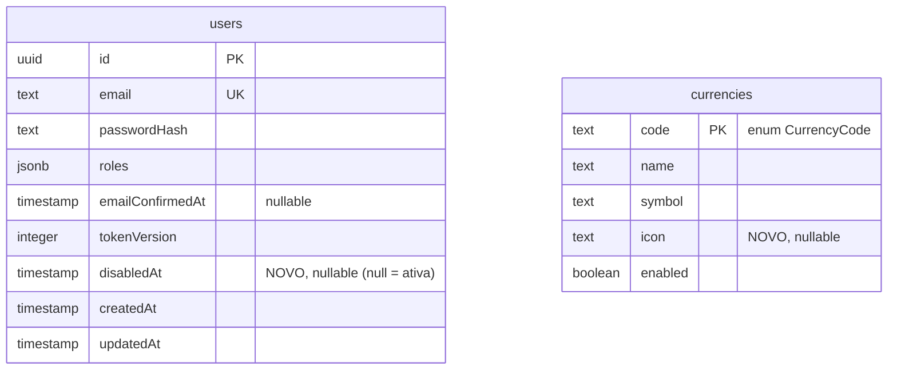
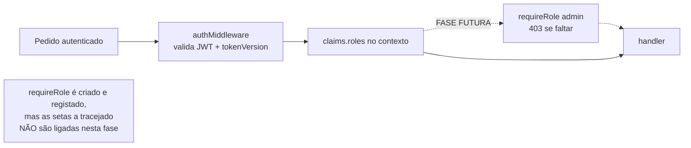
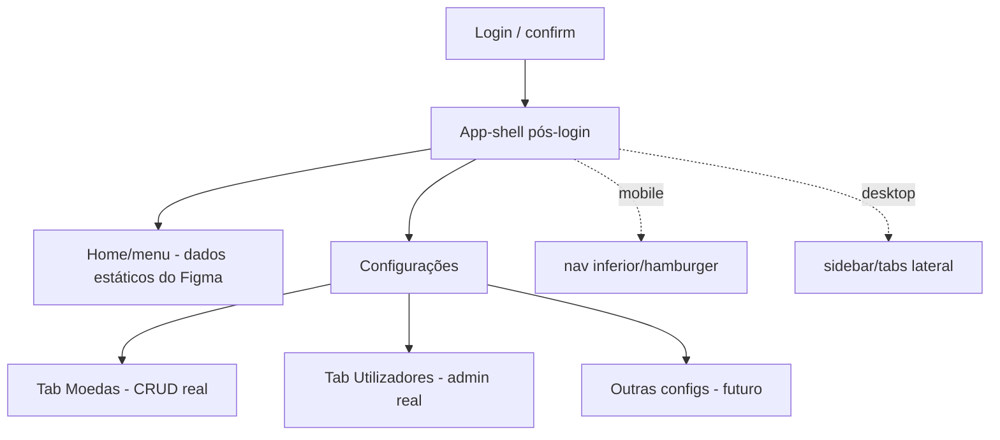

# feat: Área de Configurações — CRUD de moedas, admin de utilizadores e autorização por role

## Summary

Construir os **pré-requisitos** para a futura venda de divisas (não a venda em si): uma área
**"Configurações"** pós-login, responsiva (experiência mobile + experiência PC), com tabs/
submenus de **gestão de moedas** e **gestão de utilizadores**, mais a **estrutura de
autorização por role** no back-end.

Três frentes, decididas com o utilizador:

1. **CRUD completo de moedas** (hoje só existe listagem). Mantém-se o enum `CurrencyCode`
   fechado (AOA/BRL/USD/EUR) — o CRUD gere o conjunto existente (editar nome/sigla/símbolo/
   **ícone**, ativar/desativar). A tela de gestão de moedas liga ao **back-end real**.
2. **Administração de utilizadores** (UI **+** back-end): listar (paginado), editar,
   desativar/reativar conta, e reset de senha disparado por admin. Exige uma coluna nova de
   estado de conta.
3. **Estrutura de autorização por role** nas rotas (à imagem da maya): um middleware
   `requireRole`. Nesta fase **constrói-se a estrutura mas não se aplica o bloqueio** — o menu
   fica disponível a qualquer sessão; o aperto por role admin entra numa fase seguinte.

O front-end aproveita o login já existente: ao autenticar, entra-se na plataforma com um
**menu/home** baseado no Figma (dados estáticos por agora, exceto as duas tabs de gestão, que
são reais).

**Figma (design de referência):** https://www.figma.com/make/hpEHzbobeo6ClSKV0HO0m7/Kinguila-App

---

## Problem Frame

A venda de divisas precisa de dados de suporte (moedas geríveis) e de uma superfície de
administração. Hoje: as moedas só se listam (sem criar/editar/ativar), não há nenhuma área de
gestão no front-end pós-login (o `DefaultLayout` tem apenas um header simples e o login
encaminha para `offers`), não há qualquer guard de autorização por role (as roles já viajam
no JWT mas ninguém as verifica), e não há forma de um administrador gerir utilizadores.

O objetivo é montar esta base respeitando a Clean Architecture do back-end e a arquitetura por
feature do front-end, copiando os padrões vivos (`Offer` como molde de CRUD completo, a feature
`offers`/`auth` como molde de feature) e o padrão conceptual de role/admin da
`maya-payment-application`, **sem** ainda ligar o fluxo de venda nem forçar o bloqueio por role.

---

## Requirements

| ID  | Requisito | Origem |
| --- | --------- | ------ |
| R1  | A entidade moeda passa a ter um campo **`icon`** (opcional). | pedido |
| R2  | Existe CRUD de moedas: listar todas (incl. desativadas), obter por código, editar (nome/sigla/símbolo/ícone), ativar/desativar. | pedido |
| R3  | O modelo de moeda mantém o enum `CurrencyCode` fechado nesta fase; criar moedas arbitrárias fica fora de âmbito. | decisão do utilizador |
| R4  | "Apagar" moeda é **desativar** (`enabled=false`), nunca hard-delete (offers guardam o código como texto, sem FK; evita códigos órfãos). | segurança de dados |
| R5  | Existe um middleware `requireRole(role)` que lê as roles dos claims; é **construído e registado mas NÃO aplicado** às rotas nesta fase. | pedido |
| R6  | O back-end de admin de utilizadores permite: listar (paginado, com filtros), obter, editar, desativar/reativar, e reset de senha por admin. | decisão do utilizador |
| R7  | A entidade `User` ganha estado de conta (**`disabledAt`**) para suportar desativação; o login recusa contas desativadas. | inferido (R6) |
| R8  | O reset de senha por admin reutiliza o fluxo de email do `PasswordResetService` (sem expor senha temporária). | decisão (segurança) |
| R9  | `passwordHash` e outros segredos nunca são expostos nas respostas de admin de utilizadores. | regra de segurança |
| R10 | Existe uma área "Configurações" pós-login, responsiva (layout mobile + layout PC), com tabs/submenus. | pedido + Figma |
| R11 | A tab de gestão de moedas liga ao CRUD **real**; a tab de gestão de utilizadores liga ao **back-end real** de admin. | decisão do utilizador |
| R12 | O menu/home pós-login renderiza a informação do Figma; dados estáticos por agora exceto as duas tabs de gestão. | pedido |
| R13 | Nesta fase o menu/tabs de Configurações são visíveis a **qualquer sessão autenticada** (sem esconder por role); o `useRole` é construído mas o esconder fica para a fase de enforcement. | pedido |
| R14 | Toda rota nova é documentada em OpenAPI e aparece na Swagger UI. | regra de ouro nº9 |
| R15 | Migrations são geradas e revistas, mas aplicadas **manualmente** pelo utilizador. | regra de ouro nº4 |
| R16 | Toda implementação de back-end tem teste em `apps/api/tests/`. | regra de ouro nº7 |
| R17 | Existe um caminho de **bootstrap de conta admin** (seed idempotente), já que `register` só cria `client` e não há edição de roles nesta fase. | revisão (adversarial) |
| R18 | `update` de utilizador **não** altera `roles` nesta fase (evita auto-promoção sem bloqueio). | revisão (segurança) |
| R19 | O campo `icon` é uma string curta (chave/URL), validada, **nunca** renderizada como HTML/SVG cru. | revisão (segurança) |

---

## Key Technical Decisions

- **KTD1 — Moeda mantém o enum fechado; CRUD = editar + ativar/desativar (sem create).**
  Adicionar `icon`; o CRUD edita `name`/`symbol`/`icon` e ativa/desativa. O `code` continua
  tipado como `CurrencyCode` e acoplado às `offers`. **Não há "create" nesta fase** — com o
  enum fechado e as 4 moedas já seeded, criar moedas arbitrárias não tem caminho útil e seria
  código/teste mortos; fica para a fatia de moedas livres (desacoplar o enum).
- **KTD2 — `CurrencyRepository` continua fora do `DrizzleGenericRepository`.** A tabela
  `currencies` tem `code` como PK e **sem `id`/timestamps**; o repositório genérico assume
  `id` e injeta `updatedAt`. Estende-se o `ICurrencyRepository`/`CurrencyRepository` com
  `findAll`, `create`, `update(code, …)`, `setEnabled(code, enabled)`, filtrando por `code`.
- **KTD3 — "Delete" de moeda = soft (disable).** As `offers` guardam o código da moeda como
  **texto, sem foreign key** — um hard-delete não falharia por integridade referencial, mas
  deixaria offers com códigos órfãos (pior), além do acoplamento ao enum e do histórico. Por
  isso "remover" define `enabled=false`; reativar define `enabled=true`. Nota: desativar uma
  moeda **não** invalida offers existentes que a referenciam (ver Open Questions).
- **KTD4 — `requireRole(role)` construído mas não aplicado.** Middleware na `presentation`
  que lê `c.get('claims').roles` e devolve 403 (`code: FORBIDDEN_ROLE`) se faltar. **Exportado
  do seu módulo** (não registado no container — não há wiring de runtime nesta fase, e a forma
  é uma factory `(role) => MiddlewareHandler`), pronto a importar nas rotas quando o bloqueio
  chegar; deixa-se um TODO em `currency.routes`/`adminUser.routes` a indicar onde se ligaria.
  As rotas novas exigem apenas `requireAuth`. **Como o bloqueio por role não está ativo, esta
  fatia não deve ser implantada além de ambiente de dev** até à fase de enforcement (ver Risks).
- **KTD5 — Desativação de utilizador por `disabledAt` nullable.** Coluna timestamp (null =
  ativa), coerente com `emailConfirmedAt`. Desativar define `disabledAt=now` **e incrementa
  `tokenVersion`** (termina sessões ativas, reutilizando o padrão do logout). O `login` recusa
  contas com `disabledAt` (403 `ACCOUNT_DISABLED`). Reativar limpa `disabledAt`.
- **KTD6 — Reset de senha por admin via novo `requestForUser(userId)`.** O `request` público
  recebe **email** e é anti-enumeração (resposta genérica mesmo sem conta) — não serve
  diretamente a um admin que parte de um `userId`. Adiciona-se `requestForUser(userId)` ao
  `IPasswordResetService`: resolve o utilizador por id (**404** se não existir), invalida
  tokens anteriores e envia o email de reset. O `AdminUserService.resetPassword(id)` chama-o.
  Não se gera nem expõe senha temporária (alternativa da maya, deferida).
- **KTD7 — `AdminUserService` separado do `AuthService`.** Operações de administração vivem
  num serviço próprio (responsabilidade única), reutilizando `IUserRepository`,
  `IPasswordResetService` e `IPasswordHasher`. Nunca devolve `passwordHash` (padrão `toAuthUser`).
- **KTD8 — Paginação reutiliza o padrão `Offer`.** `PagedResult<T>` + `paged(...)`, clamp de
  `page`/`pageSize` no serviço, `count()` + `limit/offset` no repositório, query Zod com
  `z.coerce.number()`.
- **KTD9 — Front-end: novo app-shell responsivo + primeiros breakpoints (valores fixados).**
  Não há `@media` no projeto. Introduz-se a convenção mobile-first com **dois breakpoints como
  tokens**: `--k-bp-md: 640px` (1→2 colunas) e `--k-bp-lg: 1024px` (sidebar completa). A área
  de Configurações usa-os; o resto fica como está.
- **KTD10 — Menu visível a todos nesta fase; `useRole` construído mas sem esconder ainda.** O
  pedido é "menu disponível para todos" nesta fase. Logo o `useRole()` é criado, mas o
  **esconder por role fica deferido** com o enforcement (KTD4): nesta fase as tabs de
  Configurações são visíveis a qualquer sessão autenticada (resolve também o facto de ainda
  não existir nenhum admin). O acesso direto por URL também renderiza para qualquer sessão.
- **KTD11 — Navegação responsiva: sidebar no desktop, barra inferior no mobile.** O app-shell
  usa sidebar/tabs lateral em ≥`--k-bp-lg` e uma **bottom tab bar** (experiência "app de
  telemóvel") abaixo de `--k-bp-md`. Decisão fixada para desbloquear a estrutura do `AppShell`.
- **KTD12 — `icon` é uma string curta (chave/URL), nunca SVG/HTML cru.** O campo `icon` aceita
  uma chave de ícone ou URL (validação Zod: `max(2048)`, sem markup); o front-end **nunca**
  renderiza o valor como HTML/SVG (evita XSS). Render por ``/mapa de ícones.
- **KTD13 — `AdminUserResponse` por allowlist (`Pick`), nunca `Omit`.** Tipar a resposta como
  `Pick<User, 'id'|'name'|'email'|'roles'|'emailConfirmedAt'|'disabledAt'|'createdAt'|'updatedAt'>`
  para que `passwordHash`/`tokenVersion` nunca possam vazar mesmo que `User` ganhe campos novos.
- **KTD14 — `update` de utilizador NÃO altera `roles` nesta fase.** Enquanto não houver
  bloqueio por role, permitir editar `roles` num CRUD aberto seria auto-promoção a admin. O
  `update` cobre nome/estado; a edição de `roles` entra **com** o enforcement (fase seguinte).
  A primeira conta admin é criada por **seed idempotente** (ver U4), não pela UI.

---

## High-Level Technical Design

### Alterações ao modelo de dados



### Autorização por role (estrutura construída, não aplicada)



### Navegação pós-login e área de Configurações (responsiva)



---

## Output Structure

Ficheiros **novos** previstos (existentes são modificados in-place):

```
apps/api/src/
├── application/
│   ├── interfaces/services/IAdminUserService.ts            (novo)
│   ├── services/AdminUserService.ts                        (novo)
│   └── (ICurrencyService/ICurrencyRepository — modificados)
├── presentation/http/
│   ├── middlewares/requireRole.ts                          (novo)
│   ├── controllers/AdminUserController.ts                  (novo)
│   ├── routes/adminUser.routes.ts                          (novo)
│   ├── validators/currency.validators.ts                   (novo)
│   ├── validators/adminUser.validators.ts                  (novo)
│   └── openapi/paths/adminUser.docs.ts                     (novo)
└── (currencies schema / CurrencyService / CurrencyController / currency.routes / currency.docs — modificados)

apps/web/src/
├── layouts/AppShell.vue                                    (novo — shell pós-login responsivo)
├── shared/components/
│   ├── BaseTabs.vue / BaseTable.vue / BaseModal.vue        (novos)
│   ├── BaseSelect.vue / BaseToggle.vue / BaseBadge.vue     (novos, conforme necessidade)
│   └── (styles/tokens.css — add breakpoints)
└── features/settings/
    ├── views/SettingsView.vue                              (novo)
    ├── views/HomeView.vue                                  (novo — menu/home Figma, estático)
    ├── components/CurrencyManagement.vue                   (novo — CRUD real)
    ├── components/UserManagement.vue                       (novo — admin real)
    ├── services/{currencyAdminService,userAdminService}.ts (novos)
    ├── composables/{useCurrencyAdmin,useUserAdmin,useRole}.ts (novos)
    └── routes.ts                                           (novo)

packages/contracts/src/{currency.ts (mod), adminUser.ts (novo)}
docs/adr/0003-configuracoes-moedas-admin-utilizadores.md    (novo)
```

---

## Implementation Units

> Agrupadas em 5 fases. Migrations geradas e **entregues ao utilizador** (R15). Back-end
> primeiro (moedas → role → users), depois front-end.

### Fase 1 — Back-end: CRUD de moedas

### U1. Schema + repositório de moedas (campo `icon`, operações CRUD)

- **Goal:** Dar à tabela de moedas um `icon` e ao repositório as operações de escrita.
- **Requirements:** R1, R2, R3, R4.
- **Dependencies:** —
- **Files:**
  - `apps/api/src/domain/entities/Currency.ts` (add `icon: string | null`)
  - `apps/api/src/infrastructure/database/schema/currencies.ts` (coluna `icon text` nullable)
  - `apps/api/src/application/interfaces/repositories/ICurrencyRepository.ts` (add `findAll`, `update`, `setEnabled` — **sem `create`** nesta fase)
  - `apps/api/src/infrastructure/repositories/CurrencyRepository.ts` (implementar, filtrando por `code`)
  - migration gerada (revista, não aplicada)
  - `apps/api/tests/unit/infrastructure/repositories/CurrencyRepository.test.ts` (se houver teste de repo; senão cobrir via serviço)
- **Approach:** Manter o repositório fora do `DrizzleGenericRepository` (PK = `code`, sem
  `id`/timestamps). `update(code, partial)` e `setEnabled(code, enabled)` via
  `where(eq(currencies.code, code))`. `icon` opcional.
- **Patterns to follow:** `CurrencyRepository` atual; schema `currencies.ts`; skill `add-entity`/`run-migrations`.
- **Test scenarios:**
  - `findAll` devolve moedas ativas e inativas; `findAllEnabled` continua só ativas.
  - `update` altera `name`/`symbol`/`icon` da moeda existente; código inexistente → sem efeito/null.
  - `setEnabled(code,false)` desativa; `true` reativa.
- **Verification:** schema compila; SQL gerado contém a coluna `icon`; migration entregue.

### U2. Serviço, rotas e docs do CRUD de moedas

- **Goal:** Expor o CRUD de moedas por HTTP, documentado.
- **Requirements:** R2, R3, R4, R14.
- **Dependencies:** U1.
- **Files:**
  - `apps/api/src/application/interfaces/services/ICurrencyService.ts` + `apps/api/src/application/services/CurrencyService.ts` (add `listAll`, `getByCode`, `update`, `setEnabled` — **sem `create`**; `listEnabled` mantém-se)
  - `apps/api/src/presentation/http/validators/currency.validators.ts` (novo: `updateCurrencySchema`; `icon` opcional `max(2048)` sem markup)
  - `apps/api/src/presentation/http/controllers/CurrencyController.ts` (add handlers)
  - `apps/api/src/presentation/http/routes/currency.routes.ts` (add rotas; escrita com `requireAuth`)
  - `apps/api/src/presentation/http/openapi/paths/currency.docs.ts` (documentar)
  - `apps/api/src/application/constants/apiRoutes.ts` (`currencies` passa a objeto: `list` (ativas), `listAll`, `byCode`, `update`, `setEnabled`)
  - `packages/contracts/src/currency.ts` (`UpdateCurrencyRequest`; `CurrencyResponse` add `icon`)
  - `apps/api/src/composition/container.ts` (sem novo objeto — `CurrencyService`/controller já registados; confirmar)
  - `apps/api/tests/unit/application/services/CurrencyService.test.ts`
- **Approach:** Espelhar `OfferService`/`OfferController`/`offer.routes`. `update` valida ≥1
  campo (`.refine`) e o `icon` (`max(2048)`, sem markup). "Remover" = `setEnabled(false)`.
  Endpoints de leitura: `list` (só ativas, mantém compatibilidade) e `listAll` (inclui
  desativadas). Leitura pública; escrita (`update`/`setEnabled`) com `requireAuth`. **Sem
  `requireRole` ainda** (KTD4) — TODO de onde ligaria.
- **Patterns to follow:** `OfferService.ts`, `offer.validators.ts`, `offer.docs.ts`.
- **Test scenarios:**
  - `Covers R2.` `update` altera `name`/`symbol`/`icon` de uma moeda existente; payload vazio → 422; `icon` com markup/over-length → 422.
  - `Covers R4.` `setEnabled(false)` desativa: a moeda some de `list` (ativas) mas aparece em `listAll`; `setEnabled(true)` reativa.
  - `getByCode` inexistente → 404.
- **Verification:** `bun run typecheck`/`lint`/`test` verdes; `/docs` mostra as rotas de moeda.

### Fase 2 — Back-end: estrutura de autorização por role

### U3. Middleware `requireRole` (construído, não aplicado)

- **Goal:** Ter a estrutura de autorização por role pronta, sem a aplicar.
- **Requirements:** R5.
- **Dependencies:** —
- **Files:**
  - `apps/api/src/presentation/http/middlewares/requireRole.ts` (novo)
  - `apps/api/src/composition/container.ts` (expor `requireRole` em `middlewares`, ex. como factory)
  - `apps/api/tests/unit/presentation/middlewares/requireRole.test.ts`
- **Approach:** Factory `requireRole(role: string): MiddlewareHandler<AppEnv>` que lê
  `c.get('claims').roles`; se não incluir a role → 403 `Response`-style (`code: FORBIDDEN_ROLE`).
  Pressupõe `authMiddleware` antes (claims já no contexto). **Não anexar a nenhuma rota** nesta
  fase; deixar um comentário/TODO em `currency.routes`/`adminUser.routes` indicando onde se
  ligaria (`requireRole(ROLE_ADMIN)`).
- **Patterns to follow:** `authMiddleware.ts` (forma de middleware + resposta JSON 4xx);
  padrão conceptual `[Authorize(Roles=...)]` da maya (`ManagerController.cs`).
- **Test scenarios:**
  - Claims com a role exigida → chama `next()`.
  - Claims sem a role → 403 `FORBIDDEN_ROLE`, não chama `next()`.
  - Sem claims (não devia acontecer após `authMiddleware`) → 403 defensivo.
- **Verification:** testes do middleware passam; nenhuma rota o usa ainda (grep confirma).

### Fase 3 — Back-end: administração de utilizadores

### U4. Estado de conta (`disabledAt`) + listagem paginada + login

- **Goal:** Suportar desativação de conta e listagem de utilizadores.
- **Requirements:** R6, R7, R15.
- **Dependencies:** —
- **Files:**
  - `apps/api/src/domain/entities/User.ts` (add `disabledAt: Date | null`)
  - `apps/api/src/infrastructure/database/schema/users.ts` (`disabled_at timestamp` nullable)
  - `apps/api/src/infrastructure/repositories/UserRepository.ts` (`mapRow`/`toRow`; add `listPaged(filters)`)
  - `apps/api/src/application/interfaces/repositories/IUserRepository.ts` (add `listPaged`)
  - `apps/api/src/application/services/AuthService.ts` (`login` recusa `disabledAt != null` → 403 `ACCOUNT_DISABLED`)
  - `apps/api/src/infrastructure/database/seed.ts` (**seed idempotente de uma conta admin** — R17; credenciais via env, `onConflictDoNothing`)
  - migration gerada (coluna nullable; sem backfill necessário; índices em `email` já único — `name`/`role` filtram sem índice dedicado nesta fase)
  - `apps/api/tests/...` (AuthService login desativado; repo listPaged)
- **Approach:** `listPaged` espelha `OfferRepository.listActive` (filtros opcionais por
  `name`/`email`/`role`; `count()` + `limit/offset`; `orderBy(desc(createdAt))`). Ordem dos
  checks no `login`: credenciais (401) → não-confirmada (403 `ACCOUNT_NOT_CONFIRMED`) →
  desativada (403 `ACCOUNT_DISABLED`). **Bootstrap de admin (R17):** o seed cria/garante uma
  conta com `roles:['admin']`, `emailConfirmedAt=now`, a partir de `ADMIN_EMAIL`/`ADMIN_PASSWORD`
  do ambiente — único caminho para haver um admin, já que `register` só cria `client` e o
  `update` não altera roles (KTD14). Defesa em profundidade opcional: o `authMiddleware` pode
  também recusar `disabledAt != null` (além do `tokenVersion`).
- **Patterns to follow:** `OfferRepository.listActive`, `AuthService.login` (ordem dos 403).
- **Test scenarios:**
  - `Covers R7.` `login` de conta desativada → 403 `ACCOUNT_DISABLED` (distinto de não-confirmada).
  - `listPaged` pagina e filtra por email/role; página vazia → lista vazia + total correto.
  - `Covers R17.` O seed de admin é idempotente: correr duas vezes não duplica nem reativa indevidamente.
- **Verification:** typecheck verde; migration entregue.

### U5. `AdminUserService` + rotas de admin de utilizadores

- **Goal:** CRUD de administração de utilizadores por HTTP.
- **Requirements:** R6, R8, R9, R14.
- **Dependencies:** U4 (e reutiliza `PasswordResetService`).
- **Files:**
  - `apps/api/src/application/interfaces/services/IAdminUserService.ts` + `apps/api/src/application/services/AdminUserService.ts` (novos)
  - `apps/api/src/application/interfaces/services/IPasswordResetService.ts` + `PasswordResetService.ts` (add `requestForUser(userId)` — KTD6)
  - `apps/api/src/presentation/http/controllers/AdminUserController.ts` (novo)
  - `apps/api/src/presentation/http/routes/adminUser.routes.ts` (novo; `requireAuth`, **sem** `requireRole` ainda)
  - `apps/api/src/presentation/http/validators/adminUser.validators.ts` (novo)
  - `apps/api/src/presentation/http/openapi/paths/adminUser.docs.ts` (novo) + registo em `openapi/document.ts` + `tags` em `schemas.ts`
  - `apps/api/src/application/constants/apiRoutes.ts` (bloco `adminUsers`)
  - `apps/api/src/presentation/http/server.ts` (registar `registerAdminUserRoutes`)
  - `apps/api/src/composition/container.ts` (instanciar serviço + controller)
  - `packages/contracts/src/adminUser.ts` (novo: `AdminUserResponse`, `ListUsersQuery`, `UpdateUserRequest`) + barril
  - `apps/api/tests/unit/application/services/AdminUserService.test.ts`
- **Approach:** Métodos: `list(query)` (paginado), `getById`, `update(id, dto)`,
  `setDisabled(id, disabled)`, `resetPassword(id)`.
  - `update`: altera **nome/estado — NÃO `roles` nem `password`** (KTD14, evita auto-promoção
    enquanto não há bloqueio).
  - `setDisabled(true)`: define `disabledAt=now` **e** incrementa `tokenVersion` **na mesma
    atualização** (atómico — termina sessões). `setDisabled(false)`: limpa `disabledAt` e
    **nunca** repõe/reduz `tokenVersion` (a versão só sobe).
  - `resetPassword(id)`: chama `IPasswordResetService.requestForUser(id)` (KTD6) — 404 se o
    user não existir, senão invalida tokens anteriores e envia email; não devolve senha.
  - Resposta por allowlist `AdminUserResponse = Pick<User, …>` (KTD13) — `passwordHash`/
    `tokenVersion` impossíveis de vazar.
  Rotas com `requireAuth`; **TODO** de onde `requireRole(ROLE_ADMIN)` entraria (KTD4).
- **Patterns to follow:** `OfferService`/`OfferController`/`offer.routes`; `AuthService`
  (invalidação por `tokenVersion`); padrão admin da maya (`AuthService.GetUsers`/`ResetPassword`,
  `ManagerService` soft-delete).
- **Execution note:** começar pelos testes de `setDisabled` e `resetPassword` (efeitos de
  segurança: terminação de sessão e não-exposição de segredos).
- **Test scenarios:**
  - `Covers R6.` `list` pagina/filtra; `getById` inexistente → 404.
  - `Covers R18.` `update` altera nome/estado; tentar alterar `roles` ou `passwordHash` não tem efeito (campos ignorados/rejeitados).
  - `Covers R7/KTD5.` `setDisabled(true)` define `disabledAt` **e** incrementa `tokenVersion`;
    `setDisabled(false)` limpa `disabledAt` e **mantém** o `tokenVersion` (não repõe).
  - `Covers R8.` `resetPassword` de utilizador existente envia email (provider fake chamado) e
    não devolve senha; `resetPassword` de id inexistente → 404.
  - `Covers R9.` Nenhuma resposta inclui `passwordHash`/`tokenVersion` (garantido pelo tipo allowlist).
- **Verification:** testes com fakes passam; `/docs` mostra as rotas de admin.

### Fase 4 — Front-end: app-shell, componentes e Configurações

### U6. App-shell responsivo + navegação + home pós-login

- **Goal:** Superfície pós-login com navegação e layout mobile/PC.
- **Requirements:** R10, R12, R13.
- **Dependencies:** —
- **Files:**
  - `apps/web/src/layouts/AppShell.vue` (**novo** — ficheiro próprio, não extensão do DefaultLayout)
  - `apps/web/src/App.vue` (substituir o ternário por um **mapa de 3 layouts**: `auth`→AuthLayout, `app`→AppShell, default→DefaultLayout — senão `'app'` cai silenciosamente no DefaultLayout)
  - `apps/web/src/shared/styles/tokens.css` (breakpoints `--k-bp-md: 640px`, `--k-bp-lg: 1024px`)
  - `apps/web/src/features/settings/views/HomeView.vue` (novo — menu/home Figma, estático)
  - `apps/web/src/features/settings/routes.ts` (novo; `meta:{ requiresAuth:true, layout:'app' }`)
  - `apps/web/src/router/index.ts` (registar rotas; encaminhar login → home pós-login)
  - `apps/web/src/features/auth/composables/useAuthForm.ts` (destino pós-login default → home; o `redirect` da query continua a ter precedência via `redirectTo`)
  - `apps/web/src/features/auth/views/LoginView.vue` (tratar `code: ACCOUNT_DISABLED` à imagem de `ACCOUNT_NOT_CONFIRMED`)
- **Approach:** Shell com navegação (KTD11): **desktop** sidebar/tabs lateral (≥`--k-bp-lg`);
  **mobile** bottom tab bar (<`--k-bp-md`). Home renderiza dados estáticos do Figma (pode
  mostrar o nome do utilizador da store, como o DefaultLayout já faz). **Nesta fase o menu e as
  tabs são visíveis a qualquer sessão autenticada** (KTD10): o `useRole` é criado mas não
  esconde ainda; o acesso direto por URL também renderiza (TODO em `routes.ts` de onde o guard
  de role entraria).
- **Patterns to follow:** `DefaultLayout.vue`, `App.vue`, feature `offers` (estrutura), tokens
  CSS; Figma para o desenho mobile/PC. Skill `add-frontend-feature`.
- **Test scenarios:** `Test expectation: none -- sem suite de testes de front-end; verificação
  manual (mobile e desktop) + typecheck.` Se houver Vitest no futuro: alternância de layout
  por breakpoint; visibilidade do menu por role.
- **Verification:** `bun run typecheck` (web) verde; navegação funciona em mobile e desktop;
  login entra na home.

### U7. Componentes partilhados em falta (tabs, tabela, modal, select)

- **Goal:** Primitivos de UI para a área de gestão.
- **Requirements:** R10 (suporte).
- **Dependencies:** —
- **Files:** `apps/web/src/shared/components/BaseTabs.vue`, `BaseTable.vue`, `BaseModal.vue`,
  `BaseSelect.vue`, `BaseToggle.vue`, `BaseBadge.vue` (criar os que forem necessários para U8).
- **Approach:** Seguir o estilo `k-*` + tokens. Estados explícitos (para não divergirem entre U8):
  - `BaseTable`: slots de coluna; **loading** = linha única de spinner a ocupar as colunas;
    **empty** = mensagem centrada com copy por contexto ("Nenhuma moeda encontrada." /
    "Nenhum utilizador encontrado.").
  - `BaseModal`: **a guardar** = botão primário com spinner e desativado; **erro** = modal fica
    aberto com erro inline acima das ações; sem confirmação ao fechar com alterações nesta fase.
  - `BaseTabs`: controla a tab ativa. `BaseToggle`: on/off + desativado. `BaseSelect`/`BaseBadge`
    conforme necessidade.
- **Patterns to follow:** `BaseButton.vue`, `BaseInput.vue`, tokens.
- **Test scenarios:** `Test expectation: none -- componentes de UI; verificação visual.`
- **Verification:** componentes renderizam isolados; usados em U8 sem erros de tipo.

### U8. Feature Configurações — tabs de moedas (real) e utilizadores (real)

- **Goal:** As duas tabs de gestão ligadas ao back-end real.
- **Requirements:** R10, R11, R13.
- **Dependencies:** U2, U5, U6, U7.
- **Files:**
  - `apps/web/src/features/settings/views/SettingsView.vue` (container com tabs)
  - `apps/web/src/features/settings/components/CurrencyManagement.vue` (CRUD real)
  - `apps/web/src/features/settings/components/UserManagement.vue` (admin real)
  - `apps/web/src/features/settings/services/{currencyAdminService,userAdminService}.ts`
  - `apps/web/src/features/settings/composables/{useCurrencyAdmin,useUserAdmin,useRole}.ts`
  - `apps/web/src/shared/api/apiRoutes.ts` (rotas novas: `currencies` objeto, `adminUsers`)
- **Approach:** Composables no molde `useOffers` (estado `items/total/loading/error` + ações).
  **Moedas:** listar (todas), editar (modal), ativar/desativar (toggle) — via CRUD real. O
  toggle fica **desativado durante o pedido**; em erro **reverte** ao estado anterior + erro
  inline na linha.
  **Utilizadores:** listar (paginado), editar (nome/estado — **não roles**, KTD14),
  desativar/reativar, reset de senha. Paginação = **prev/next** com página atual/total; mudar
  filtro **reinicia para a página 1**; filtros com **debounce** (~300ms). O botão de reset
  mostra spinner → "Email enviado" (~2s) → repõe; em erro, erro inline. Erros via `ApiError`.
  **Nesta fase ambas as tabs são visíveis a qualquer sessão autenticada** (KTD10); `useRole`
  é construído mas não esconde ainda.
- **Patterns to follow:** `useOffers.ts`, `offerService.ts`, `httpClient.ts`, `auth.store`.
- **Test scenarios:** `Test expectation: none -- sem suite FE; verificação manual ponta-a-ponta:
  criar/editar/ativar moeda reflete na BD; listar/editar/desativar/reset de utilizador funciona.`
- **Verification:** `bun run typecheck` (web) verde; fluxo manual contra o back-end local.

### Fase 5 — Finalização

### U9. ADR + gate + migrations

- **Goal:** Registar decisões e validar o conjunto.
- **Requirements:** R14, R15, R16.
- **Dependencies:** U1–U8.
- **Files:** `docs/adr/0003-configuracoes-moedas-admin-utilizadores.md` (novo); `.env.example`
  (add `ADMIN_EMAIL`/`ADMIN_PASSWORD` do seed de admin).
- **Approach:** ADR no formato dos existentes, registando: KTD1 (enum mantido, sem create),
  KTD3 (soft-disable; offers sem FK), KTD4 (role construído **não aplicado** — e o risco
  temporário + **não implantar fora de dev**), KTD5 (`disabledAt`+tokenVersion atómico), KTD6
  (reset por admin via `requestForUser`), KTD9 (breakpoints), KTD13 (`AdminUserResponse`
  allowlist), KTD14 (`update` não mexe em `roles`; bootstrap de admin por seed). Correr o gate
  completo.
- **Test scenarios:** `Test expectation: none -- documentação.`
- **Verification:** `typecheck`/`lint`/`test` verdes em `apps/api`; migrations entregues (não
  aplicadas); `/docs` mostra as rotas novas.

---

## Scope Boundaries

**Em âmbito:** CRUD de moedas (enum mantido, +`icon`, soft-disable); estrutura `requireRole`
(não aplicada); back-end de admin de utilizadores (listar/editar/desativar/reativar/reset);
coluna `disabledAt`; app-shell responsivo pós-login + home estática; componentes UI em falta;
tabs de Configurações (moedas e utilizadores) ligadas ao back-end real; OpenAPI; ADR; migrations
manuais.

### Deferred to Follow-Up Work

- **Aplicar o bloqueio por role** (`requireRole(ROLE_ADMIN)` nas rotas de moeda/admin e guard
  de rota no FE). A estrutura fica pronta; ligar é a fase seguinte. **Em conjunto** entram: a
  **edição de `roles`** pela UI de admin (com salvaguarda anti-auto-promoção) e o **esconder
  por role** no menu/tabs (`useRole` deixa de mostrar a não-admins).
- **Moedas livres** (criar moedas arbitrárias) — exige desacoplar `offers` do enum `CurrencyCode`.
- **Outras tabs de Configurações** (perfil, preferências…) — só placeholders/estático por agora.
- **Reset por admin com senha temporária** (alternativa ao email) — não implementado.
- **Suite de testes de front-end** (Vitest) — não existe; verificação manual nesta fase.
- **Criar utilizadores admin pela UI** (equivalente ao `CreateManager` da maya) — fora desta
  fatia; admin de utilizadores cobre gerir os existentes.

### Não-objetivos

- O fluxo de **venda de divisas** em si (esta fatia só prepara os pré-requisitos).
- Substituir o módulo Identity ou alterar o fluxo de refresh/tokens existente.

---

## Open Questions

- **RESOLVIDO — Edição de `roles` na UI:** removida desta fase (KTD14/R18). A edição de roles
  entra com o enforcement; a 1ª conta admin vem do seed (R17).
- **RESOLVIDO — Breakpoints e navegação mobile:** fixados (KTD9: 640/1024; KTD11: sidebar
  desktop / bottom tab bar mobile). Afinar ao detalhe pelo Figma durante U6.
- **PARA DECIDIR — Gating das rotas de admin já nesta fase:** os revisores de segurança
  recomendam aplicar `requireRole(ROLE_ADMIN)` às rotas de admin de utilizadores **já** (PII +
  desativar/reset de outros), mesmo mantendo as de moeda só com `requireAuth`. O pedido foi
  "estrutura sem bloqueio" — manteve-se assim (dev-only), mas é uma decisão que podes querer
  rever. (Ver Risks.)
- **PARA DECIDIR — Moeda desativada vs offers existentes:** desativar uma moeda não invalida
  offers que a referenciam (sem FK). Definir o comportamento esperado (continuam válidas? são
  sinalizadas/escondidas?) — provavelmente fora desta fatia, mas a registar.

---

## Risks & Dependencies

| Risco | Impacto | Mitigação |
| ----- | ------- | --------- |
| Rotas de admin (listar PII, desativar contas, reset de outros) acessíveis a qualquer sessão (role não aplicado) | **alto** | Decisão consciente desta fase (KTD4) mas com risco elevado: **não implantar fora de dev** até ligar `requireRole`; mínimo `requireAuth`; ligar o bloqueio é a 1ª tarefa da fase seguinte. |
| Auto-promoção a admin via edição de `roles` no `update` | **alto** | Mitigado: `update` **não** altera `roles` nesta fase (KTD14, R18); editar roles entra só com o enforcement. |
| `icon` malicioso (SVG/HTML) → XSS na UI de admin | médio | `icon` é string curta validada (KTD12, R19); o FE nunca o renderiza como HTML/SVG (usa ``/mapa de ícones). |
| Hard-delete de moeda quebraria `offers` | alto | "Delete" = soft-disable (KTD3); sem endpoint de hard-delete. |
| Desativar utilizador não termina sessões ativas | médio | `setDisabled` incrementa `tokenVersion` (KTD5); `login` recusa `ACCOUNT_DISABLED`. |
| Expor `passwordHash`/`tokenVersion` nas respostas de admin | alto | Mapeamento explícito `AdminUserResponse` sem segredos (KTD7/R9); teste dedicado. |
| Enum `CurrencyCode` vs "criar moeda" | médio | CRUD valida `code` contra o enum (KTD1); criar moeda livre fica deferido. |
| Primeiros breakpoints/responsividade sem convenção prévia | baixo | Introduzir como tokens/convenção partilhada (KTD9); aplicar só na área nova. |
| Migration aplicada por engano | alto | Regra de ouro nº4 — gerar, rever, entregar; nunca aplicar (R15). |

**Dependências:** front-end de Configurações (U8) depende do back-end de moedas (U2) e de admin
(U5) e dos componentes (U7) e shell (U6). Sem dependências externas novas.

---

## Sources & Research

- **Referência viva (CRUD):** `apps/api/src/application/services/OfferService.ts`,
  `presentation/http/controllers/OfferController.ts`, `routes/offer.routes.ts`,
  `validators/offer.validators.ts`, `infrastructure/repositories/OfferRepository.ts`.
- **Moeda atual:** `apps/api/src/domain/entities/Currency.ts`,
  `infrastructure/database/schema/currencies.ts`, `repositories/CurrencyRepository.ts`,
  `application/services/CurrencyService.ts`, `domain/enums/CurrencyCode.ts`.
- **Identity/auth:** `apps/api/src/application/services/AuthService.ts`,
  `PasswordResetService.ts`, `infrastructure/repositories/UserRepository.ts`,
  `presentation/http/middlewares/authMiddleware.ts`, `domain/entities/Role.ts`.
- **Paginação:** `apps/api/src/application/common/PagedResult.ts`,
  `OfferRepository.listActive`, `validators/offer.validators.ts`.
- **Front-end:** `apps/web/src/layouts/DefaultLayout.vue`, `App.vue`, `router/index.ts`,
  feature `features/offers/` (views/services/composables), `shared/components/`,
  `shared/styles/tokens.css`, `shared/api/httpClient.ts`.
- **Referência externa (padrão conceptual):** `maya-payment-application` —
  `ManagerController.cs` (`[Authorize(Roles=...)]`), `AuthService.cs` (`GetUsers`,
  `ResetPassword`), `ManagerService.cs` (soft-delete/`IsActive`), `JwtTokenService.cs` (roles
  nos claims). Moedas na maya são enum fixo (sem CRUD) — confirma a opção de manter o enum.
- **Learnings:** não existe `docs/solutions/` — terreno novo; candidatos a `/ce-compound` no
  fim (forma do `requireRole`, soft-disable de moeda, `disabledAt`+tokenVersion, breakpoints).
