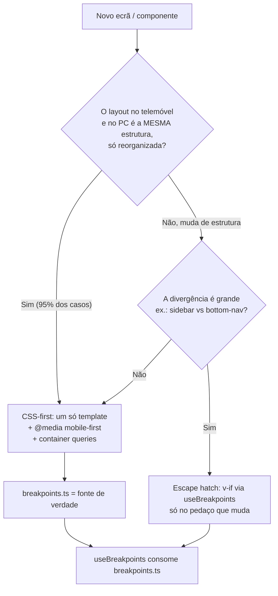

# feat: Responsividade e layouts por dispositivo (telemóvel vs PC) no front-end

**Target repo:** kinguila-application (`apps/web`)

## Resumo

O front-end (`apps/web`) ainda **não tem infraestrutura de responsividade estrutural**: não
há uma única `@media` query, nem escala de breakpoints, nem deteção reativa de viewport. A
responsividade atual é apenas fluida (`max-width` + `grid auto-fill`). O design (Figma) mostra
layouts que, em alguns ecrãs, mudam de **estrutura** entre telemóvel e PC (ex.: navegação de
topo/sidebar no PC vs navegação compacta no telemóvel), não só de tamanho.

Este plano estabelece a **base** e a **convenção documentada** para o projeto tratar essa
diferença de forma consistente, seguindo a boa prática de mercado — **CSS-first com válvula de
escape** — e prova o padrão num ecrã de referência (o shell autenticado). **Não** implementa
o design pixel-perfect dos ecrãs do Figma; isso fica para trabalho de seguimento, por decisão
explícita do utilizador ("o design vemos depois").

**Product Contract preservation:** não aplicável — plano de origem direta (`ce-plan-bootstrap`),
sem requirements doc a montante.

---

## Problem Frame

- **Hoje:** zero breakpoints/`@media`, zero deteção de dispositivo. Layouts iguais em qualquer
  largura; só esticam. O mecanismo de layout existente (`App.vue` → `route.meta.layout`) escolhe
  entre `DefaultLayout` e `AuthLayout`, mas nenhum layout muda de estrutura por dispositivo.
- **Problema:** quando uma futura feature precisar de um layout estruturalmente diferente no
  telemóvel vs PC, não há padrão nem ferramenta para o fazer — cada implementação inventaria a
  sua própria solução, gerando inconsistência e duplicação.
- **Objetivo:** dar ao projeto (1) uma escala de breakpoints única, (2) um composable reativo de
  deteção de viewport, (3) uma regra clara e documentada de *quando* é "a mesma view só
  responsiva" vs *quando* se ramifica a estrutura, e (4) um ecrã de referência que prove o padrão.

---

## Requirements

| ID | Requisito |
| -- | --------- |
| R1 | O projeto define uma **escala de breakpoints única** (fonte de verdade), consumível por JS e CSS. |
| R2 | O front-end **deteta reactivamente** a classe de viewport (telemóvel vs PC) via composable partilhado. |
| R3 | Existe uma **regra documentada**: CSS-first por omissão; ramificar o DOM (escape hatch) só quando a estrutura diverge mesmo. |
| R4 | Um **ecrã de referência** (o shell `DefaultLayout`) aplica o padrão e serve de exemplo vivo. |
| R5 | A convenção está registada na **documentação** (`docs/frontend-architecture.md`) e na **skill** `add-frontend-feature`, para futuras features a seguirem. |
| R6 | A lógica com comportamento (o composable) tem **teste automatizado**, cumprindo a regra de ouro nº7. |

**Sucesso:** um programador que vá criar um ecrã novo sabe, sem perguntar, como tratar
telemóvel vs PC e tem as ferramentas (tokens + composable) já disponíveis.

---

## Key Technical Decisions

- **KTD1 — Estratégia: CSS-first + escape hatch.** Regra geral: um só template, o CSS
  (`@media`, e futuramente *container queries*) reorganiza. Ramifica-se o DOM
  (`v-if` alimentado pelo composable) **só** quando a estrutura diverge de facto (ex.: navegação).
  *(session-settled: user-directed — escolhido sobre "ficheiros separados por dispositivo
  `.mobile.vue`/`.desktop.vue`": menos duplicação, uma só fonte de verdade por ecrã, padrão de
  mercado ~90% das SPAs.)*
- **KTD2 — Escala de breakpoints alinhada ao Tailwind, corte principal a 768px.**
  `sm 480 · md 768 · lg 1024 · xl 1280`. O corte "telemóvel vs PC" para conteúdo é **768px (md)**;
  decisões de *app-shell*/sidebar usam **1024px (lg)**.
  *(session-settled: user-approved — default de mercado; alternativa 1024px como corte principal
  foi apresentada e preterida.)*
- **KTD3 — Fonte de verdade dos breakpoints em TS; CSS usa literais documentados.** As `@media`
  **não** leem CSS custom properties (`@media (min-width: var(--x))` não funciona), e o projeto
  não usa pré-processador. Logo a fonte de verdade é um módulo TS (`shared/breakpoints.ts`),
  consumido pelo composable; nas folhas de estilo usam-se os literais px, documentados contra
  esse módulo. *Alternativa (deferida):* adotar `postcss-custom-media` para `@media (--k-md)` e
  eliminar a duplicação — ver Deferred.
- **KTD4 — Mobile-first (`min-width`).** Estilos base = telemóvel; `@media (min-width: …)`
  progressivamente adiciona o layout de ecrãs maiores. Consistente com o mercado.
- **KTD5 — Testes de front-end via `bun:test` em `apps/web/tests/` a espelhar `src/`.** Mesma
  filosofia da camada `apps/api/tests/` (camada dedicada, não co-localizada). Este plano cria o
  **primeiro** teste do front-end e o script `test` do `apps/web`, com `window.matchMedia`
  mockado. *(session-settled: user-approved — cumprir a regra de ouro nº7 mantendo a convenção
  de testes já existente.)*

---

## High-Level Technical Design

Fluxo de decisão que a convenção codifica (o coração do KTD1) e a cadeia de dependências da infra:

**Cadeia da infra:** `shared/breakpoints.ts` (valores) → `shared/composables/useBreakpoints.ts`
(estado reativo) → `layouts/DefaultLayout.vue` (consumidor de referência) → documentação.

---

## Implementation Units

### U1. Escala de breakpoints como fonte de verdade

- **Goal:** definir a escala de breakpoints **uma vez**, tipada, reutilizável por JS (composable)
  e documentada para o CSS.
- **Requirements:** R1 (ver KTD2, KTD3, KTD4).
- **Dependencies:** nenhuma.
- **Files:**
  - `apps/web/src/shared/breakpoints.ts` *(novo)* — `export const BREAKPOINTS = { sm: 480, md: 768, lg: 1024, xl: 1280 } as const`, tipo `Breakpoint`, e um helper puro `minWidthQuery(bp): string` que devolve `"(min-width: 768px)"`.
  - `apps/web/src/shared/styles/tokens.css` *(modificar)* — bloco comentado que documenta a escala (mesmos valores) e a regra mobile-first, deixando claro que os literais px nas `@media` têm de coincidir com `breakpoints.ts`.
  - `apps/web/tests/shared/breakpoints.test.ts` *(novo)* — teste da unidade.
- **Approach:** módulo puro, sem dependências de DOM. Ordem crescente garantida
  (`sm < md < lg < xl`). Mobile-first: só se exportam queries `min-width`.
- **Patterns to follow:** estilo de `shared/utils/formatCurrency.ts` (função pura, tipada).
- **Test scenarios:**
  - `BREAKPOINTS` tem as 4 chaves e valores estritamente crescentes (480 < 768 < 1024 < 1280).
  - `minWidthQuery('md')` devolve exatamente `"(min-width: 768px)"`.
  - `minWidthQuery('lg')` devolve `"(min-width: 1024px)"`.
- **Verification:** `bun run --cwd apps/web typecheck` passa; o teste de `breakpoints.test.ts` passa.

### U2. Composable `useBreakpoints` + bootstrap do harness de testes do front-end

- **Goal:** expor estado **reativo** da viewport (`isMobile`, `isDesktop`, `greaterOrEqual(bp)`)
  baseado em `window.matchMedia`, com limpeza de listeners e seguro quando `window` não existe.
  Simultaneamente, arrancar o harness de testes do `apps/web`.
- **Requirements:** R2, R6 (ver KTD5).
- **Dependencies:** U1.
- **Files:**
  - `apps/web/src/shared/composables/useBreakpoints.ts` *(novo)* — usa `BREAKPOINTS`; `isMobile = largura < md (768)`; `isDesktop = !isMobile`; `greaterOrEqual('lg')` para decisões de shell; regista listeners de `matchMedia` e limpa em `onScopeDispose`.
  - `apps/web/package.json` *(modificar)* — adicionar `"test": "bun test ./tests"` (espelha o script do `apps/api`).
  - `apps/web/tests/helpers/matchMedia.ts` *(novo)* — helper que instala um `window.matchMedia` mockável (largura simulada + disparo de eventos `change`).
  - `apps/web/tests/shared/composables/useBreakpoints.test.ts` *(novo)*.
- **Approach:** um `MediaQueryList` por breakpoint relevante; o estado deriva das queries
  `min-width`. Guardar contra `typeof window === 'undefined'` (segurança para
  pré-render/futuro SSR) devolvendo um default sensato (assumir desktop). Sem dependência de
  `@vue/test-utils` — o composable devolve refs testáveis diretamente.
- **Execution note:** lógica reativa pura — bom candidato a test-first; começar pelo mock de
  `matchMedia` e por um teste que cruze o corte dos 768px.
- **Patterns to follow:** composables existentes (`features/offers/composables/useOffers.ts`)
  para o estilo de estado reativo; convenção de testes de `apps/api/tests/` (camada dedicada,
  `bun:test`, `describe/it/expect`).
- **Test scenarios:**
  - Largura mockada em 500px → `isMobile === true`, `isDesktop === false`.
  - Largura mockada em 1200px → `isMobile === false`, `isDesktop === true`.
  - Cruzar o corte: disparar `change` de 500px→1000px atualiza `isMobile` de `true`→`false`.
  - `greaterOrEqual('lg')` é `false` a 900px e `true` a 1024px.
  - Ao destruir o scope, os listeners de `matchMedia` são removidos (sem fugas).
  - Sem `window` (simulado) → devolve default desktop sem lançar erro.
- **Verification:** `bun run --cwd apps/web test` corre e passa; `typecheck` passa.

### U3. Shell responsivo de referência (`DefaultLayout`) — prova o padrão

- **Goal:** aplicar **CSS-first + escape hatch** ao shell autenticado como exemplo vivo: conteúdo
  fluido por CSS; a **navegação** é o pedaço que ramifica de estrutura (topo no PC vs compacta no
  telemóvel).
- **Requirements:** R3, R4 (demonstra KTD1).
- **Dependencies:** U1, U2.
- **Files:**
  - `apps/web/src/layouts/DefaultLayout.vue` *(modificar)* — CSS mobile-first; escape hatch com `useBreakpoints` para alternar a estrutura de navegação; substituir as cores hardcoded (`#e1e4e8`, `#1f6feb`) pelos tokens (`--k-gray-200`, `--k-blue`/`--k-navy`) já que o ficheiro está a ser tocado.
  - `apps/web/src/layouts/components/AppNavDesktop.vue` *(novo)* — barra de navegação de topo (o que já existe hoje, extraído).
  - `apps/web/src/layouts/components/AppNavMobile.vue` *(novo)* — navegação compacta (menu/drawer ou bottom-nav simples; estrutura, sem design final).
- **Approach:** `main`/conteúdo permanece um só template, responsivo por `@media` mobile-first.
  Só a `<nav>` usa `v-if="isMobile"` / `v-else` — é o caso legítimo de escape hatch. Manter os
  `.vue` curtos extraindo os dois componentes de navegação (regra front-end nº2).
- **Test scenarios:** `Test expectation: none — mudança estrutural/visual, verificada por browser`
  (não há valor em testar CSS/estrutura com unit test; a lógica reativa já está coberta em U2).
- **Verification (smoke por browser, `bun run dev`):**
  - Em largura < 768px aparece `AppNavMobile`; em ≥ 768px aparece `AppNavDesktop`.
  - Redimensionar a janela cruzando os 768px alterna a navegação sem erros de consola.
  - O conteúdo (`layout__content`) reflui sem `@media` "mágicas" a partir do CSS mobile-first.
  - Cores do shell vêm dos tokens (sem hex hardcoded remanescente).

### U4. Documentar a convenção (docs + skill)

- **Goal:** registar a regra para que futuras implementações a sigam sem reinventar.
- **Requirements:** R5.
- **Dependencies:** U1, U2, U3.
- **Files:**
  - `docs/frontend-architecture.md` *(modificar)* — nova secção "Responsividade e layouts por
    dispositivo": regra CSS-first, escala de breakpoints (KTD2), `useBreakpoints` (KTD2/R2),
    quando usar o escape hatch (fluxograma do KTD1), mobile-first (KTD4), e *container queries*
    como direção futura ao nível do componente.
  - `.claude/skills/add-frontend-feature/SKILL.md` *(modificar)* — passo e item de checklist
    novos: "considera telemóvel vs PC — CSS-first por omissão; usa `useBreakpoints` só quando a
    estrutura diverge; breakpoints de `shared/breakpoints.ts`".
- **Approach:** documentação apontando para os artefactos reais criados em U1–U3 como exemplo
  vivo (à imagem do "Offer/Currency como referência viva" do projeto).
- **Test scenarios:** `Test expectation: none — documentação`.
- **Verification:** a secção existe e é coerente com o código de U1–U3; a skill referencia o
  composable e os tokens; os exemplos citados existem nos caminhos indicados.

---

## Scope Boundaries

**No âmbito:** infraestrutura (U1 tokens/constantes, U2 composable + primeiro teste FE), ecrã de
referência (U3 shell), documentação (U4).

### Deferred to Follow-Up Work

- **Design pixel-perfect dos ecrãs do Figma** (auth, offers, dashboard) — explicitamente "vemos
  depois".
- **Ecrã `/dashboard`** — ainda não existe; será uma feature própria que *consumirá* esta base.
- **Retrofit dos ecrãs existentes** (auth/offers) para mobile/PC segundo o Figma.
- **`postcss-custom-media`** — upgrade opcional para eliminar a duplicação de literais entre
  `breakpoints.ts` e as `@media` (KTD3, alternativa).
- **Testes de componente/E2E** (`@vue/test-utils`, Playwright) — este plano só cobre o teste
  unitário do composable; testar layout visual fica para uma decisão futura de tooling.

### Non-goals (identidade do produto)

- Não é objetivo suportar deteção de dispositivo no servidor (a app é CSR hoje); o composable só
  se guarda contra ausência de `window` por segurança.

---

## Assumptions

- A app é **client-side rendered** (Vite SPA); não há SSR a exigir deteção de dispositivo no
  servidor. O composable mantém uma guarda defensiva mesmo assim.
- O ecrã de referência é o **shell `DefaultLayout`** (não o `/dashboard`, que ainda não existe),
  por ser onde telemóvel e PC mais divergem hoje e por já envolver navegação autenticada.

---

## System-Wide Impact

- **Transversal a todas as features:** a partir daqui, qualquer view pode importar
  `useBreakpoints` e os tokens de breakpoint. Nenhuma feature existente muda de comportamento
  (só o shell ganha navegação responsiva).
- **Novo script `test` no `apps/web`:** o gate de validação do monorepo passa a poder incluir
  testes de front-end no futuro (hoje `bun run test` na raiz só corre `apps/api`; considerar
  agregar depois — fora do âmbito).

---

## Risks & Dependencies

- **Risco: duplicação de valores** entre `breakpoints.ts` e as `@media` (KTD3). *Mitigação:*
  comentário-âncora no `tokens.css` e na secção de docs; caminho de upgrade documentado
  (`postcss-custom-media`).
- **Risco: `matchMedia` em ambiente de teste** — não existe em `bun:test` puro. *Mitigação:* o
  helper `tests/helpers/matchMedia.ts` (U2) instala um mock explícito.
- **Risco: escape hatch usado em excesso** (ramificar quando CSS bastava). *Mitigação:* o
  fluxograma do KTD1 na documentação torna a regra inequívoca.

---

## Sources & Research

Pesquisa externa **não** foi executada via ferramentas; as decisões assentam em prática de
mercado consolidada (conhecimento até jan/2026), confirmada com o utilizador nesta sessão:

- Escalas de breakpoints de facto: **Tailwind** (`sm 640 / md 768 / lg 1024 / xl 1280`),
  Bootstrap, MUI — base do KTD2.
- **VueUse `useBreakpoints`/`useMediaQuery`** como padrão de deteção reativa no ecossistema Vue —
  base do KTD2/U2 (implementação própria e mínima, sem adicionar a dependência).
- **Mobile-first** (`min-width`) e **container queries** como consenso/direção atual — base do
  KTD4 e da nota de futuro em U4.

---

## Definition of Done

- [ ] `apps/web/src/shared/breakpoints.ts` criado e testado (U1).
- [ ] `useBreakpoints` criado, com harness de testes do `apps/web` a funcionar e a passar (U2).
- [ ] `DefaultLayout` demonstra CSS-first + escape hatch na navegação, com tokens (U3).
- [ ] `docs/frontend-architecture.md` e a skill `add-frontend-feature` documentam a convenção (U4).
- [ ] `bun run --cwd apps/web typecheck`, `bun run lint` e `bun run --cwd apps/web test` passam.
- [ ] Verificação por browser do shell em <768px e ≥768px sem erros de consola.
