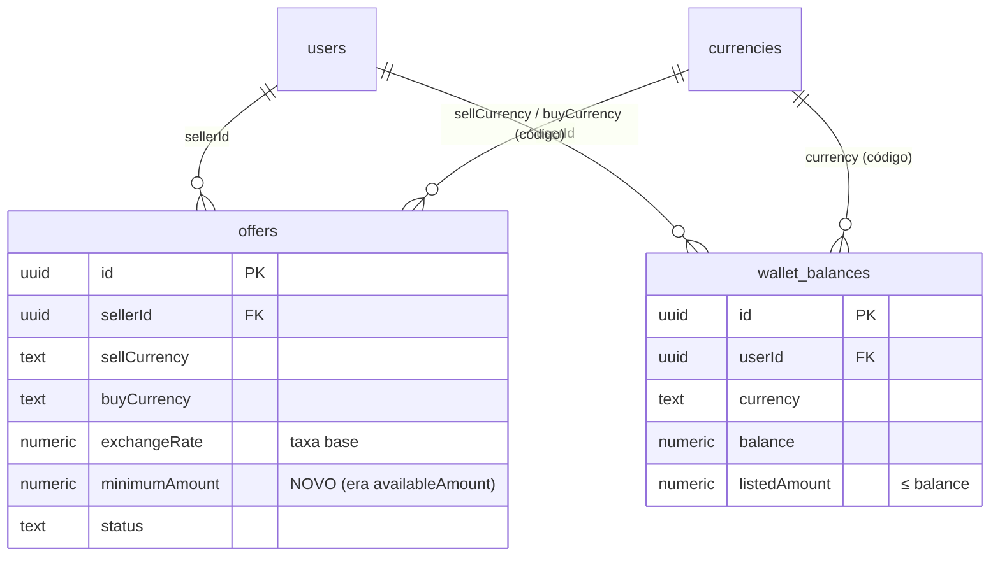
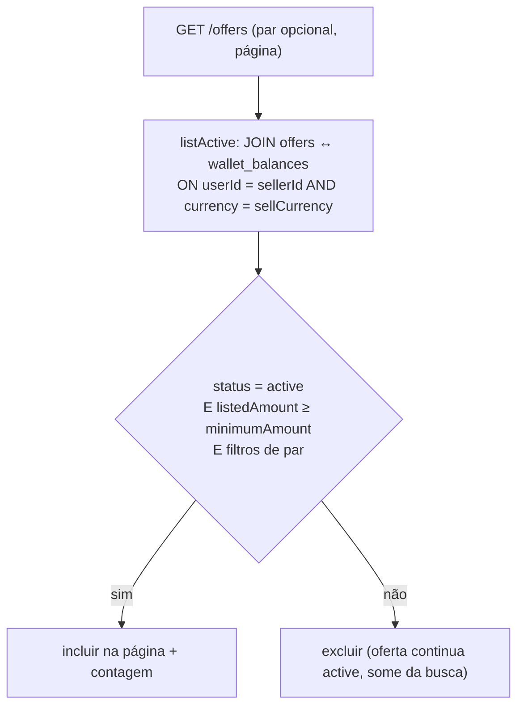

# Fluxo de ofertas com disponibilidade derivada da wallet - Plan

## Goal Capsule

- **Objetivo**: as ofertas de câmbio passam a ser *serviços permanentes* (par + taxa base + valor mínimo) cuja **disponibilidade deriva do saldo da wallet** na moeda de origem — não é informada oferta a oferta.
- **Autoridade de produto**: decisões de modelo fechadas em brainstorm (KD1–KD5, agora KTD1–KTD5). O CRUD de ofertas e o GET de moedas ativas **já existem**; este trabalho **refatora** o modelo da oferta e **introduz** a wallet mínima.
- **Prontidão**: implementation-ready. **Product Contract preservation**: Product Contract unchanged (R/A/F/AE e KD preservados; migração `availableAmount → minimumAmount` implementa R1).
- **Bloqueios**: nenhum. Dependências de sequenciamento com o futuro *fluxo de ordens* ficam em Open Questions.

---

## Problem Frame

Hoje a `Offer` carrega `availableAmount` na própria oferta (`apps/api/src/domain/entities/Offer.ts`). Isto obriga o vendedor a informar quanto tem a cada publicação, permite montantes obsoletos e — com várias ofertas a vender a mesma moeda — permite **prometer o mesmo dinheiro em várias ofertas**, porque o montante pertence de facto à *moeda*, não ao *par*.

A plataforma quer ofertas como **serviços disponíveis** ("troco EUR→USD à taxa X"), com a disponibilidade calculada **à parte** a partir do saldo. Um vendedor sem exposição suficiente simplesmente **não aparece** na busca, evitando republicações.

---

## Actors

- **A1 — Vendedor**: publica/gere ofertas; controla quanto do saldo expõe para venda (por moeda).
- **A2 — Comprador**: procura ofertas disponíveis (só vê ofertas com disponibilidade real).
- **A3 — Admin/Seed**: credita o saldo real (`balance`) enquanto não existe fluxo de depósito.

---

## Key Flows

- **F1 — Publicar oferta**: escolhe par (a partir das moedas ativas), define **taxa base** e **valor mínimo**; nasce `active`. Sem montante na oferta.
- **F2 — Definir exposição de venda**: define, **por moeda**, o `listedAmount` (≤ `balance`). É o que dita se as ofertas dessa moeda aparecem.
- **F3 — Procurar ofertas**: lista ofertas, opcionalmente por par; a lista devolve **apenas** ofertas visíveis.
- **F4 — Ver/gerir a wallet**: consulta saldos e montantes expostos por moeda; atualiza o `listedAmount`.
- **F5 — Ver moedas ativas**: já implementado (`GET /currencies`); mantém-se.

---

## Requirements

### Oferta (refactor do modelo existente)
- **R1** — A oferta deixa de guardar `availableAmount`; passa a guardar **`minimumAmount`** (valor mínimo da venda, na **moeda de origem**).
- **R2** — Mantém: vendedor, par `sellCurrency → buyCurrency`, **taxa base** (`exchangeRate`) e `status` (`active`/`paused`/`completed`/`cancelled`).
- **R3** — Ao criar: moedas **diferentes**; ambas `enabled`; `taxa base > 0`; `minimumAmount > 0`.
- **R4** — Só o vendedor dono altera/remove a oferta (regra existente, preservar).

### Wallet mínima (nova)
- **R5** — Uma wallet por utilizador mantém, **por moeda**: `balance` e `listedAmount`.
- **R6** — Invariante `0 ≤ listedAmount ≤ balance`. Expor mais que o saldo é rejeitado.
- **R7** — O vendedor **lê** a sua wallet e **atualiza** o `listedAmount` de uma moeda.
- **R8** — O `balance` real **não** é definido pelo vendedor nesta iteração; é creditado via seed/admin.

### Disponibilidade / visibilidade derivada
- **R9** — Oferta **visível** sse `status = active` **E** `listedAmount(sellCurrency) ≥ minimumAmount`.
- **R10** — Ofertas ativas da mesma moeda **partilham** o mesmo `listedAmount`. Sem teto por oferta.
- **R11** — Visibilidade **calculada na leitura**; o `status` **não** muda sozinho abaixo do mínimo.
- **R12** — `GET /offers` devolve só ofertas visíveis (preserva filtros por par + paginação). `GET /offers/:id` devolve independentemente da visibilidade.

---

## Acceptance Examples

- **AE1** (F1+R3) — Cria EUR→USD, taxa 1.08, mínimo 50 → `active`. Origem=destino, moeda desativada, ou taxa/mínimo ≤ 0 → rejeitado.
- **AE2** (F2+R6) — `balance` EUR=5000, define `listedAmount` EUR=3000 → aceite; define 6000 → rejeitado.
- **AE3** (R9+R10) — EUR→USD (mín. 50) e EUR→BRL (mín. 100), `listedAmount` EUR=80 → busca mostra só EUR→USD. Sobe para 120 → ambas aparecem.
- **AE4** (R11) — `listedAmount` EUR=0 → nenhuma oferta EUR na busca, mas continuam `active` e visíveis por `getById`; ao repor, voltam sem republicar.
- **AE5** (R12) — `GET /offers?sellCurrency=EUR&buyCurrency=USD` → só ofertas visíveis desse par.

---

## Key Technical Decisions

- **KTD1** — Disponibilidade derivada do saldo, não guardada na oferta. *(session-settled: user-directed — escolhido sobre "montante por oferta": o montante é per-moeda; a oferta é serviço permanente. Instancia KD1.)*
- **KTD2** — Wallet mínima nesta iteração (saldo + exposição por moeda; sem funding nem reserva). *(session-settled: user-directed — escolhido sobre "wallet completa agora". Instancia KD2.)*
- **KTD3** — "Quanto quero vender" vive por moeda (`listedAmount`), não por oferta. *(session-settled: user-directed — escolhido sobre "teto por oferta". Instancia KD3.)*
- **KTD4** — Visibilidade calculada na leitura; `status` não muda sozinho. *(session-settled: user-approved. Instancia KD4.)*
- **KTD5** — Taxa base = taxa do vendedor; sem margem da plataforma. *(session-settled: user-approved. Instancia KD5.)*
- **KTD6** — A wallet é a tabela **`wallet_balances`** (uma linha por `(userId, currency)` com `balance` + `listedAmount`), com **repositório próprio** (padrão de `ICurrencyRepository`, não o genérico), porque o acesso é por `(userId, currency)` e não por `id`. *(session-settled: user-approved no plano.)*
- **KTD7** — A visibilidade (R9) é um **JOIN em SQL** dentro de `OfferRepository.listActive` (`offers ↔ wallet_balances` por `sellerId`+`sellCurrency`, `listedAmount ≥ minimumAmount`), para manter a paginação correta. A correção do JOIN é verificada **a correr a app**; os testes unitários com fakes cobrem o contrato do serviço e a validação `listedAmount ≤ balance`. *(session-settled: user-approved no plano.)*
- **KTD8** — Saldo de teste creditado por um helper no `seed.ts` (conta admin de bootstrap); **sem** endpoint de crédito (funding deferido). *(session-settled: user-approved no plano.)*
- **KTD9** — Refactor destrutivo de `offers` (dropar `available_amount`, adicionar `minimum_amount`) via **migration manual e revista** (regra de ouro nº4). *(session-settled: user-approved no plano.)*

---

## High-Level Technical Design

Modelo de dados após a mudança (a `wallet_balances` é nova; `offers` troca uma coluna):

Regra de visibilidade (R9) na listagem — a lógica que liga as duas tabelas:

---

## Implementation Units

### U1. Domínio e schema da WalletBalance
- **Goal**: introduzir a entidade `WalletBalance` e a tabela `wallet_balances`.
- **Requirements**: R5, R6 (estrutura); suporta KTD6.
- **Dependencies**: nenhuma.
- **Files**: `apps/api/src/domain/entities/WalletBalance.ts` (novo), `apps/api/src/infrastructure/database/schema/walletBalances.ts` (novo), `apps/api/src/infrastructure/database/schema/index.ts` (reexport).
- **Approach**: entidade `{ id, userId, currency: CurrencyCode, balance: number, listedAmount: number, createdAt, updatedAt }`. Tabela: `id` uuid PK, `user_id` uuid FK `users` (`onDelete: 'cascade'`), `currency` text notNull, `balance` numeric(18,2) notNull default `'0'`, `listed_amount` numeric(18,2) notNull default `'0'`, timestamps. **Índice único** `(user_id, currency)` (serve também o JOIN de U5). Códigos como texto; dinheiro em `numeric`.
- **Patterns to follow**: `apps/api/src/infrastructure/database/schema/offers.ts` (numeric, índices, FK), `Currency.ts` para a entidade.
- **Test scenarios**: `Test expectation: none — tipos de domínio + schema, sem comportamento (a lógica é validada em U3/U6).`
- **Verification**: `bun run typecheck` passa; `wallet_balances` reexportada no `schema/index.ts`.

### U2. Repositório da WalletBalance (interface + Drizzle) + DI
- **Goal**: acesso a saldos por `(userId, currency)`.
- **Requirements**: R5, R7, R8.
- **Dependencies**: U1.
- **Files**: `apps/api/src/application/interfaces/repositories/IWalletRepository.ts` (novo), `apps/api/src/infrastructure/repositories/WalletBalanceRepository.ts` (novo), `apps/api/src/composition/container.ts` (registar), `apps/api/tests/helpers/fakes/FakeWalletRepository.ts` (novo).
- **Approach**: interface própria (espelha `ICurrencyRepository`): `findByUser(userId): Promise<WalletBalance[]>`, `findByUserAndCurrency(userId, currency): Promise<WalletBalance | null>`, `setListedAmount(userId, currency, amount): Promise<WalletBalance | null>`, `creditBalance(userId, currency, amount): Promise<WalletBalance>` (upsert por `(user_id, currency)`, incrementa `balance`). Mapeamento `numeric`↔`number` como em `OfferRepository.mapRow`. Registar `walletRepository` no container. `FakeWalletRepository` como duplo em memória para os testes de U3.
- **Patterns to follow**: `apps/api/src/infrastructure/repositories/OfferRepository.ts` (mapRow/toRow), `CurrencyRepository`, `apps/api/tests/helpers/fakes/FakeCurrencyRepository.ts`.
- **Test scenarios**: `Test expectation: none — repositório ligado à BD; a implementação Drizzle é verificada a correr (seed U6 + smoke U5). A regra ≤ saldo vive no serviço (U3) e é testada aí; o FakeWalletRepository é helper de teste.`
- **Verification**: container instancia sem erro; app arranca.

### U3. Serviço e endpoints da wallet
- **Goal**: ler a wallet e atualizar o `listedAmount` com a invariante ≤ saldo.
- **Requirements**: R5, R6, R7. **Approach cita KTD3, KTD6.**
- **Dependencies**: U1, U2.
- **Files**: `packages/contracts/src/wallet.ts` (novo) + `packages/contracts/src/index.ts` (reexport); `apps/api/src/application/interfaces/services/IWalletService.ts` (novo); `apps/api/src/application/services/WalletService.ts` (novo); `apps/api/src/presentation/http/validators/wallet.validators.ts` (novo); `apps/api/src/presentation/http/controllers/WalletController.ts` (novo); `apps/api/src/presentation/http/routes/wallet.routes.ts` (novo); `apps/api/src/application/constants/apiRoutes.ts` (grupo `wallet`); `apps/api/src/presentation/http/openapi/paths/wallet.docs.ts` (novo) + `openapi/document.ts` (registar) + `openapi/schemas.ts` (`walletBalanceResponseSchema`); `apps/api/src/presentation/http/server.ts` (registar rotas); `apps/api/src/composition/container.ts` (serviço + controller); `apps/api/tests/unit/application/services/WalletService.test.ts` (novo).
- **Approach**: contratos `WalletBalanceResponse { currency, balance, listedAmount }` e `SetListedAmountRequest { listedAmount: number }`. `WalletService.getMyWallet(userId)` → `repo.findByUser`, mapeia. `WalletService.setListedAmount(userId, currency, amount)`: se `amount < 0` → `Response.fail`; carrega `findByUserAndCurrency`; se `null` → `Response.fail('Sem saldo nessa moeda.')`; se `amount > balance` → `Response.fail('Não pode expor mais do que o saldo disponível.')`; senão `repo.setListedAmount` → `Response.ok`. Rotas: `GET apiRoutes.wallet.me` (requireAuth) e `PATCH apiRoutes.wallet.setListedAmount` = `.../wallet/:currency/listed-amount` (requireAuth, `validate`). Controller usa `c.get('userId')` e `c.req.param('currency')`. Validator `setListedAmountSchema = z.object({ listedAmount: z.number().nonnegative() })`; validar `currency` contra `CURRENCY_CODES` no serviço.
- **Patterns to follow**: `CurrencyService` + `CurrencyController` + `currency` routes/docs; `OfferController` (obter `userId`).
- **Test scenarios** (feature-bearing):
  - `getMyWallet` devolve os saldos do utilizador, mapeados (happy path).
  - `Covers AE2.` `setListedAmount` com `amount ≤ balance` → `ok` e persistido.
  - `Covers AE2.` `setListedAmount` com `amount > balance` → `fail` (não persiste).
  - `setListedAmount` sem linha de saldo para a moeda → `fail('Sem saldo…')`.
  - `setListedAmount` com valor negativo → rejeitado.
  - `setListedAmount` com `currency` fora de `CURRENCY_CODES` → `fail`.
- **Verification**: `GET /wallet` devolve saldos; `PATCH …/listed-amount` altera; ambas visíveis em `/docs`.

### U4. Refactor da oferta: `availableAmount` → `minimumAmount`
- **Goal**: substituir o montante-por-oferta pelo valor mínimo, em todas as camadas.
- **Requirements**: R1, R2, R3, R4. **Approach cita KTD1.**
- **Dependencies**: nenhuma (lado da oferta; independente da wallet).
- **Files**: `apps/api/src/domain/entities/Offer.ts`; `apps/api/src/infrastructure/database/schema/offers.ts`; `packages/contracts/src/offer.ts`; `apps/api/src/presentation/http/validators/offer.validators.ts`; `apps/api/src/application/services/OfferService.ts`; `apps/api/src/infrastructure/repositories/OfferRepository.ts` (mapRow/toRow); `apps/api/src/presentation/http/openapi/schemas.ts` (`offerResponseSchema`); `apps/api/tests/helpers/fakes/FakeOfferRepository.ts`; `apps/api/tests/unit/application/services/OfferService.test.ts`.
- **Approach**: renomear `availableAmount → minimumAmount` (na moeda de origem) na entidade, contratos (`CreateOfferRequest`/`UpdateOfferRequest`/`OfferResponse`), validators (`positive`), schema (`minimum_amount` numeric(18,2) notNull), mapRow/toRow, `toResponse` e schema OpenAPI. `OfferService.create`: validar `exchangeRate > 0 && minimumAmount > 0`. `update`: `minimumAmount` opcional > 0. Remover toda a lógica de `availableAmount`.
- **Patterns to follow**: o próprio `OfferService`/`OfferRepository` (só troca o campo).
- **Test scenarios** (feature-bearing, atualizar os existentes):
  - `Covers AE1.` criar par válido + taxa + mínimo → `created`, `active`.
  - `Covers AE1.` origem = destino → `fail`.
  - `Covers AE1.` moeda desativada → `fail`.
  - `Covers AE1.` taxa ≤ 0 ou mínimo ≤ 0 → `fail`.
  - `update` com `minimumAmount ≤ 0` → `fail`; não-dono a atualizar/remover → `forbidden`.
  - `toResponse` devolve `minimumAmount` (e já não `availableAmount`).
- **Verification**: criar/listar/detalhe devolvem `minimumAmount`; `bun run typecheck` limpo em `packages/contracts` e `apps/api`.

### U5. Visibilidade derivada na listagem de ofertas
- **Goal**: `GET /offers` só devolve ofertas com exposição suficiente (R9).
- **Requirements**: R9, R10, R11, R12. **Approach cita KTD7.**
- **Dependencies**: U1, U4.
- **Files**: `apps/api/src/infrastructure/repositories/OfferRepository.ts` (`listActive`); `apps/api/tests/helpers/fakes/FakeOfferRepository.ts` (simular predicado); `apps/api/tests/unit/application/services/OfferService.test.ts` (cenários de visibilidade).
- **Approach**: em `listActive`, `innerJoin(walletBalances)` em `walletBalances.userId = offers.sellerId AND walletBalances.currency = offers.sellCurrency`, e adicionar a condição `walletBalances.listedAmount >= offers.minimumAmount` (comparação `numeric`). Manter `status='active'`, filtros de par, `orderBy`, `limit/offset`. **A contagem (`count`) tem de usar o mesmo JOIN e condições**, senão o `total` fica errado. `OfferService.list` não muda (o JOIN é interno ao repositório). O `FakeOfferRepository` recebe um conjunto de saldos injetados e aplica o mesmo predicado, para testar o contrato do serviço.
- **Execution note**: a correção do JOIN em SQL confirma-se a correr contra a BD de dev (smoke); o fake cobre o contrato.
- **Test scenarios**:
  - `Covers AE3.` oferta com `minimumAmount` acima do `listedAmount` do vendedor é excluída; abaixo é incluída.
  - `Covers AE4.` `listedAmount = 0` → nenhuma oferta dessa moeda listada; `getById` ainda devolve a oferta.
  - `Covers AE5.` filtro por par devolve só as visíveis desse par.
  - `total` da paginação reflete apenas as ofertas visíveis.
- **Verification**: a correr — semear wallet (U6), criar ofertas com mínimos diferentes, `GET /offers` muda conforme o `listedAmount` sobe/desce.

### U6. Seed de saldos de teste
- **Goal**: creditar saldos à conta admin de bootstrap para demonstrar o fluxo (R8).
- **Requirements**: R8. **Approach cita KTD8.**
- **Dependencies**: U1, U2.
- **Files**: `apps/api/src/infrastructure/database/seed.ts`.
- **Approach**: `seedWalletBalances(db)` — se a conta admin existir, credita alguns saldos (ex.: EUR/USD/AOA/BRL) com um `listedAmount` inicial, idempotente (`onConflictDoNothing` sobre `(user_id, currency)`). Guardado como o `seedAdmin` (só se houver admin).
- **Patterns to follow**: `seedCurrencies`/`seedAdmin` no mesmo ficheiro.
- **Test scenarios**: `Test expectation: none — ferramenta de seed/dev, verificada por 'bun run db:seed'.`
- **Verification**: após seed, a wallet do admin tem saldos e as ofertas do admin tornam-se visíveis.

### U7. Migration manual (gerar, rever, entregar)
- **Goal**: materializar as mudanças de schema (`wallet_balances` nova; `offers` troca coluna) sem aplicar automaticamente.
- **Requirements**: R1, R5. **Approach cita KTD9.**
- **Dependencies**: U1, U4.
- **Files**: `apps/api/src/infrastructure/database/migrations/*` (gerados por `db:generate`).
- **Approach**: correr `bun run db:generate`; DDL esperado — `CREATE TABLE wallet_balances` (+ índice único `(user_id, currency)`), `ALTER TABLE offers DROP COLUMN available_amount`, `ADD COLUMN minimum_amount numeric(18,2) NOT NULL`. **Atenção**: `NOT NULL` sem default numa tabela com linhas existentes falha — em dev assume-se `offers` vazia; caso contrário, adicionar com default temporário e backfill, ou limpar. **Rever o SQL** antes de aplicar. O agente **não** aplica (regra de ouro nº4 / skill `run-migrations`); entrega os comandos ao utilizador.
- **Execution note**: migration é **manual** — entregar `bun run db:generate` (rever) e `bun run db:migrate`; não executar.
- **Test scenarios**: `Test expectation: none — migração manual de BD, verificada por 'bun run db:migrate' e pelo arranque da app.`
- **Verification**: `bun run db:migrate` aplica sem erros; a app arranca; endpoints respondem.

---

## Scope Boundaries

### Nesta iteração
- Refactor da `Offer` (`availableAmount → minimumAmount`) em todas as camadas + OpenAPI + testes.
- `wallet_balances` (saldo + exposição por moeda) com migration manual.
- Endpoints do vendedor: ler wallet, atualizar `listedAmount`.
- Visibilidade derivada na listagem (JOIN).
- Seed de saldos de teste.

### Deferido para trabalho futuro (PR/iterações seguintes)
- **Fluxo de ordens** + reserva/dedução de `listedAmount`/`balance` na venda (a metade "as vendas gastam o teto" de R9–R11).
- **Funding real** da wallet (depósitos); endpoint de crédito de saldo (admin/utilizador).
- Lista **"as minhas ofertas"** para o vendedor gerir ofertas invisíveis (hoje via `getById`).

### Fora da identidade do produto (por agora)
- **Margem/spread da plataforma** sobre a cotação — a taxa base é a do vendedor.
- **Exposição diferente por par** (teto por oferta) — rejeitado a favor do teto por moeda.

---

## Verification Contract

- `bun run typecheck`, `bun run lint`, `bun run test` — todos verdes.
- Migration: `bun run db:generate` (SQL revisto) e `bun run db:migrate` aplicados **pelo utilizador**.
- `/docs` (Swagger UI) mostra `GET /wallet` e `PATCH /wallet/:currency/listed-amount`.
- Smoke: seed → definir `listedAmount` → criar ofertas com mínimos diferentes → `GET /offers` reflete a visibilidade (AE3/AE4/AE5) e reage a alterações do `listedAmount`.

---

## Definition of Done

- `availableAmount` totalmente removido (domínio, schema, contratos, validators, OpenAPI, testes).
- `wallet_balances`, repositório, serviço e endpoints ligados no `composition/container.ts` e no `server.ts`.
- Visibilidade derivada funciona a correr (JOIN correto na listagem e na contagem).
- Todos os cenários de teste dos U3, U4 e U5 implementados e a passar.
- Comandos de migration entregues e aplicados pelo utilizador; app arranca.
- Guard-rails verdes (typecheck/lint/test) e rotas novas documentadas em `/docs`.

---

## Open Questions

- **OQ1** — Fluxo de ordens: como a abertura de ordem **reserva** e **debita** `listedAmount`/`balance` (evitar dois compradores sobre o mesmo saldo). Bloqueia a metade "as vendas gastam o teto".
- **OQ2** — Funding: por que via o `balance` é creditado em produção.
- **OQ3** — UI: onde o vendedor edita o `listedAmount` (vista da moeda/wallet vs. na oferta); o armazenamento é sempre por moeda.
- **OQ4** — Monetização: se/como entra margem da plataforma sobre a taxa base.

---

## Sources & Research

- Brainstorm em sessão (2026-07-25) — KD1–KD5 → KTD1–KTD5.
- Padrões existentes revistos: `apps/api/src/application/services/OfferService.ts`, `apps/api/src/infrastructure/repositories/OfferRepository.ts` + `DrizzleGenericRepository.ts`, `apps/api/src/infrastructure/database/schema/offers.ts` e `currencies.ts`, `apps/api/src/composition/container.ts`, `apps/api/src/presentation/http/controllers/OfferController.ts` + `routes/offer.routes.ts` + `validators/offer.validators.ts` + `openapi/paths/offer.docs.ts`, `apps/api/src/application/services/CurrencyService.ts` + `interfaces/repositories/ICurrencyRepository.ts`, `apps/api/src/infrastructure/database/seed.ts`, `packages/contracts/src/offer.ts`.
- Skills de referência: `.claude/skills/add-entity/SKILL.md`, `add-service`, `run-migrations`, `write-tests`.
